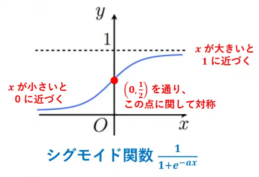

# E資格範囲数式まとめ
<!-- _paginate: false -->
<!-- _class: title -->
<!-- footer: E資格範囲の数式まとめ  -->

# 線形代数 ※範囲外
<!-- _paginate: false -->

## 固有方程式
<!-- _header: 線形代数 -->

$$ \large \det (\lambda I - A) = 0$$

##### ◆ポイント・各要素の意味など

- $\det$　は行列式(determinant) を意味する。 \
$\left| \begin{array}{cc} \lambda I - A \end{array} \right| =0$　と表現される事もある。
- $\lambda$　は固有値
- $I$　は単位行列
- $A$　はn次正方行列

### 特異値分解
<!-- _header: 線形代数 -->

$$ \large A = U\Sigma V^T $$

##### ◆ポイント・各要素の意味など

- $A$　は
- $U$　は
- $\Sigma$　は
- $V^T$　は
-

# 確率・統計・情報理論
<!-- _paginate: false -->

## ベルヌーイ分布の確率密度関数
<!-- _header: 確率・統計・情報理論 -->

$$ f(x;p) = p^x(1-p)^{1-x} $$

### ベルヌーイ分布の期待値
<!-- _header: 確率・統計・情報理論 -->

$$\begin{align}\mathbb{E}[X] &= \sum_{x=0}^{1}xp^x(1-p)^{1-x} \\&= p\end{align}$$

### ベルヌーイ分布の分散
<!-- _header: 確率・統計・情報理論 -->

$$\begin{align}Var[X] &= \mathbb{E}[(X-\mathbb{E}[X])^2)] \\
  Var[X] &= \mathbb{E}[X^2]-\mathbb{E}[X]^2 \\
  &= \sum_{x=0}^{1}x^2p^x(1-p)^{1-x}-p^2 \\
  &= p-p^2\\&=p(1-p)\end{align}$$

##### ◆ポイント・各要素の意味など
- $x$　は成功か失敗を表す変数（$k$で表されることもある？）
- $p$　は単一試行での成功確率
- $f(x;p)$　はベルヌーイ分布の**確率質量関数**で、パラメータ$p$が与えられた時の変数$x$の関数という意味
- $x=1$ の場合、 $p^x=p$ となり $(1-p)^{1-x} = 1$ となるため、
$$f(x;p)=p$$
- $x=0$ の場合、 $p^x=1$ となり $(1-p)^{1-x} = 1-p$ となるため、
$$f(x;p)=1-p$$
- $p$の$x$乗の様な表現はただのモデル化であり物理的プロセスや現象を直接表現しているわけではない？（「こうするとうまく表現できる」以上の深い意味はない？）

## マルチヌーイ分布の確率密度関数
<!-- _header: 確率・統計・情報理論 -->
- カテゴリ分布とも呼ばれる

$$\begin{align}
f(x;p) &= \prod_{j=1}^{k}p_j^{x_j} \\
(ただし、\sum_{j=1}^{k}p_j &=1、0\le p_j \le 1、j=1,....)
\end{align}$$

### マルチヌーイ分布の負の対数尤度
<!-- _header: 確率・統計・情報理論 -->

$$\begin{align} -\log L_D (p) &= -\log\prod_{i=1}^{n}f(x_i;p)　 \\
  &= -\sum_{i=1}^{n}\log\prod_{j=1}^{k}p_j^{x_{ij}} \\
  &= -\sum_{i=1}^{n}\sum_{j=1}^{k}\log p_j^{x_{ij}} \\
  &= -\sum_{i=1}^{n}\sum_{j=1}^{k}x_{ij}\log p_j
  \end{align}$$

##### ◆ポイント・各要素の意味など
-

## 正規分布
<!-- _header: 確率・統計・情報理論 -->

$$\large f(x; \mu,\sigma^2) = \frac{1}{\sqrt{2\pi\sigma^2}}\exp\left(-\frac{1}{2\sigma^2}(x-\mu)^2\right)$$

### 正規分布の負の対数尤度
<!-- _header: 確率・統計・情報理論 -->

$$\begin{align} L(\mu) &= \prod_{i=1}^{n}f(x_i;\mu)\\
&=\prod_{i=1}^{n}\frac{1}{\sqrt{2\pi}}\exp\left(-\frac{1}{2}(x_i-\mu)^2\right)\\\\
 -\log L(\mu) &= -\log \left(\prod_{i=1}^{n}\frac{1}{\sqrt{2\pi}}\exp\left(-\frac{1}{2}(x_i-\mu)^2\right)\right)\\
&=-\sum_{i=1}^{n}\log\left(\frac{1}{\sqrt{2\pi}}\exp\left(-\frac{1}{2}(x_i-\mu)^2\right)\right)\\
&=-\sum_{i=1}^{n}\left(\log\left(\frac{1}{\sqrt{2\pi}}\right)-\frac{1}{2}(x_i-\mu)^2\right)\\
&=-n\log\left(\frac{1}{\sqrt{2\pi}}\right)-\frac{1}{2}\sum_{i=1}^{n}(x_i-\mu)^2\\
\end{align}$$
##### ◆ポイント・各要素の意味など
- $\sigma$：標準偏差
- $\sigma^2$：分散
- $\mu$：平均

## 正規分布の最尤推定
<!-- _header: 確率・統計・情報理論 -->
$$\large\begin{align}
\frac{d}{d\mu}g(\mu) &= \frac{1}{2}\sum_{i=1}^{n}\frac{d}{d\mu}(x_i-\mu)^2\\
&= \frac{1}{2}\sum_{i=1}^{n}(-2(x_i-\mu))\\
&= \sum_{i=1}^{n}\mu-\sum_{i=1}^{n}x_i\\
&= n\mu-\sum_{i=1}^{n}x_i\\
\end{align}$$

$$\large\hat\mu = \frac{1}{n}\sum_{i=1}^{n}x_i$$

##### ◆ポイント・各要素の意味など
-

## エントロピー
<!-- _header: 確率・統計・情報理論 -->
$$\large H(X) = -\sum_{x}p(x)\log_2p(x)$$

### 交差エントロピー(クロスエントロピー)の定義
<!-- _header: 確率・統計・情報理論 -->
$$\large H(p,q) = -\sum_{x}p(x)\log_2q(x)$$
##### ◆ポイント・各要素の意味など
- $p(x)$　真の(正解の)確率分布
- $q(x)$　推定したモデルの確率分布

### バイナリクロスエントロピー

$$\large {D_{BC} = -p\log q-(1-p)\log(1-q)}$$

##### ◆ポイント・各要素の意味など
- 交差エントロピーに下記を代入
- $p(x=0)=p$
- $p(x=1)=1-p$
- $q(x=0)=q$
- $q(x=1)=1-q$

## KLダイバージェンス
<!-- _header: 確率・統計・情報理論 -->
- 二つの確率分布の間の差異や情報の損失を測定するための指標。
- 非対称
- 交差エントロピーとエントロピーの差として定義される。
- 離散変数の場合
$$\large D(p||q) = \sum_{x}p(x)\log\frac{p(x)}{q(x)}$$
- 連続変数の場合
$$D(p∥q)=\int p(x)\log\left( \frac{q(x)}{p(x)} \right) dx$$

##### ◆ポイント・各要素の意味など

- $p$：真の確率分布からの確率密度または確率質量関数
- $q$：モデルや推定された確率分布からの確率密度または確率質量関数

### JSダイバージェンス
<!-- _header: 確率・統計・情報理論 -->

- KLダイバージェンスの非対称性を解消したもの
$$ D_{JS}(p||q) = \frac{1}{2}\left(\sum_{x}p(x)\log_2\frac{p(x)}{r(x)}+\sum_{x}q(x)\log_2\frac{q(x)}{r(x)}\right)$$
$$ r(x) = \frac{p(x)+q(x)}{2}$$

##### ◆ポイント・各要素の意味など
- $r(x)$：$p$と$q$の平均分布。
- $p$と$r$、$q$と$r$それぞれについて**KLダイバージェンスを求め、その平均**をとったのがJSダイバージェンス

## ベイズの定理
$$\large p(C|x) = \frac{p(x|C)p(C)}{p(x)}$$

##### ◆ポイント・各要素の意味など

## モンテカルロ積分

- 連続型確率分布$p(x)$と$q(x;\theta)$の交差エントロピーは下記
$$H(p,q)=-\int_x p(x)\log q(x;\theta) dx$$

- 真の分布$p(x)$による期待値が不明なので、データ$D$の平均により置き換える
$$\tilde H(p,q)=-\frac{1}{n}\sum_{i=1}^n \log q(x_i;\theta)$$

##### ◆ポイント・各要素の意味など
-

# 機械学習の基礎
<!-- _paginate: false -->

## バイアス・バリアンス・ノイズ
<!-- _header: 機械学習の基礎 -->

$$\large\mathbb{E}(L) = \int\{y(x)-h(x)\}^2p(x)dx +\iint\{h(x)-t\}^2p(x,t)dxdt$$

バイアス：$\large\int\{\mathbb{E}_D[y(x;D)] - h(x)\}^2p(x)dx$

バリアンス：$\large\int\mathbb{E}_D[\{y(x;D) - \mathbb{E}_D[y(x;D)]\}^2p(x)dx$

ノイズ：$\iint\{h(x) - t\}^2p(x,t)dxdt$

##### ◆ポイント・各要素の意味など
-

## オッズ
<!-- _header: 教師あり学習 --->
- ロジスティック回帰
$$\large \frac{p(y=1|x)}{p(y=0|x)}=\frac{\hat y}{1-\hat y}$$

$$\large\begin{align}
\frac{\hat y}{1-\hat y} &= \frac{\frac{1}{1+\exp(-w^Tx-b)}}{1-\frac{1}{1+\exp(-w^Tx-b)}}\\
&= \frac{1}{(1+\exp(-w^Tx-b))-1}\\
&= \frac{1}{\exp(-w^Tx-b)}\\
&= \exp(w^Tx-b)
\end{align}$$

##### ◆ポイント・各要素の意味など
-

## ガウスカーネル（動径基底関数、RBFカーネル）
<!-- _header: 教師あり学習--->
- SVM（サポートベクターマシン）
$$\large k(x,x')=\exp\left(-\frac{||x-x'||^2}{\beta}\right)$$

##### ◆ポイント・各要素の意味など
-

## 正則化
<!-- _header: 　 --->
$$\large\begin{align}
&E+\lambda_2||w||_2^2 \\
&E+\lambda_1||w||_1 \\
&E+\lambda_1||w||_1+ \lambda_2||w||_2^2
\end{align}$$

##### ◆ポイント・各要素の意味など
- リッジ
- ラッソ
- エラスティックネット

# 活性化関数

## シグモイド関数
<!-- _header: 活性化関数 --->
$$\large f(x) = \frac{1}{1+\exp(-x)}$$

##### ◆ポイント・各要素の意味など

- 初期の活性化関数
- 微分しやすい
- 層数が多いNNでは勾配消失が起こりやすいため、近年あまり使われていない
- どんな入力値に対しても0<y<1 の範囲をとる
- $\exp(-x)$ は $e^{-x}$ の意、x=0の時1となるため、$f(x)=\frac{1}{2}$となる
- 

## ReLU関数
<!-- _header: 活性化関数 --->
$$\large f(x) = \max(0,x)$$

```python
np.maximum(0, x)
```

##### ◆ポイント・各要素の意味など

- ニューラルネットワークの活性化関数
- max(0,x)なので、y=xとy=0のうち大きい方という意味
- x=0の時は微分できない
- 

## ソフトマックス関数
<!-- _header: 活性化関数 --->

$$\large \text{softmax}(z)_i=\frac{\exp(z_i)}{\Sigma_j\exp(z_j)}$$
$$\large y_i=\frac{e^{x_i}}{e^{x_1}+e^{x_2}+ \cdots+e^{x_n}} \hspace{30px}(i=1,\cdots,n)$$

```python
np.exp(z) / np.sum(np.exp(z))
```

##### ◆ポイント・各要素の意味など
- 分類問題の確率分布を表す為に使用
- i=1~nの場合それぞれの出力値の合計が1になる

# 順伝播計算と逆伝播計算

## 二乗和誤差
<!-- _header: 損失関数--->
$$\large \frac{1}{2}\sum_{k=1}^{K}(y_k-t_k)^2$$

$y_k$で偏微分すると、k=1~Kのうちk番目以外の項が0になるため
$$\large y_k-t_k$$

##### ◆ポイント・各要素の意味など
- 損失関数の１つ
- $y_k-t_k$は予測値と正解値との誤差。二乗することで必ず正の値になるようにしている。

## 交差エントロピー誤差（多クラス分類）

<!-- _header: 損失関数--->
$$\large E = -\frac{1}{N}\sum_{n}\sum_{k}t_{nk}\log y_{nk}$$

##### ◆ポイント・各要素の意味など

- $N$：データ個数（サンプル数）
- $k$：データの次元数（クラス数？）

## アフィンレイヤ
<!-- _header: 全結合型ニューラルネットワーク --->
$$\large H = XW + B$$
コード

```python
## アフィン変換
affine[i] = np.dot(activations[i], self.coefs_[i]) + self.intercepts_[i]
```

重みの勾配
$$\large \frac{\partial L}{\partial W} = X^T\frac{\partial L}{\partial H}$$
入力の勾配
$$\large \frac{\partial L}{\partial X} = \frac{\partial L}{\partial H}W^T$$

```python
## 入力(activations)の勾配を算出
deltas[i - 1] = np.dot(deltas[i], self.coefs_[i].T)
```

##### ◆ポイント・各要素の意味など

- X: 入力データ。
- W: 重み行列。
- B: バイアスベクトル。

## 確率的勾配降下法（SGD）
<!-- _header: 最適化アルゴリズム--->
パラメータ更新式
$$\large \theta_{t+1} = \theta_t- \eta\frac{\partial L}{\partial \theta_t}$$

```python
params[key] = params[key] - self.lr * grads[key]

## -=を使って下記の様に短く書ける
params[key] -= self.lr * grads[key]
```

##### ◆ポイント・各要素の意味など
- $\eta$は学習率
- $\theta$はパラメータ、$\theta_{t}$は更新前$\theta_{t+1}$が更新後
- $\frac{\partial L}{\partial \theta_t}$はパラメータの勾配

## モーメンタム
<!-- _header: 最適化アルゴリズム--->

- 更新速度の項を導入する事で勾配降下法よりも、谷での収束が早くなる
- 同じ方向に進もうとする → 加速する
- 逆の方向に進もうとする → ブレーキをかける
$$\large v_{t+1} = av_t - \eta\frac{\partial L}{\partial \theta_t}$$
$$\large \theta_{t+1} = \theta_t+v_{t+1}$$

```python
self.v[key] = self.momentum*self.v[key] - self.lr*grads[key]
params[key] += self.v[key]
```

##### ◆ポイント・各要素の意味など

- $\alpha$：モーメンタム係数
- $v_t$：時刻tにおける速度（パラメータの更新量）
- $\eta$は学習率
- $\theta$はパラメータ、$\theta_{t}$は更新前$\theta_{t+1}$が更新後
- $\frac{\partial L}{\partial \theta_t}$はパラメータの勾配

##### SGDとの比較


## NesterovAG（※モーメンタム改良版）
<!-- _header: 最適化アルゴリズム--->
$$\large v_{t+1} = av_t - \eta\frac{\partial L}{\partial (\theta_t + av_t)}$$
$$\large \theta_{t+1} = \theta_t+v_{t+1}$$

##### 計算難しいので実装し易くする

$$\large v_{t+1} = av_t - \eta\frac{\partial L}{\partial\Theta_t}$$
$$\large \Theta_{t+1} = \Theta_t+\alpha^2v_t-(1+\alpha)\eta\frac{\partial L}{\partial\Theta_t}$$

```python
params[key] += self.momentum * self.momentum * self.v[key]
params[key] -= (1 + self.momentum) * self.lr * grads[key]
self.v[key] *= self.momentum
self.v[key] -= self.lr * grads[key]
```

##### ◆ポイント・各要素の意味など

- $\alpha$：モーメンタム係数
- $v_t$：時刻tにおける速度（パラメータの更新量）
- $\eta$は学習率
- $\theta$はパラメータ、$\theta_{t}$は更新前$\theta_{t+1}$が更新後
- $\frac{\partial L}{\partial \theta_t}$はパラメータの勾配
-

## AdaGrad
<!-- _header: 最適化アルゴリズム--->

- 勾配情報の蓄積により学習率を変化させる
- 過去の勾配情報を（アダマール積により）パラメータ毎に蓄積
$$
\large
h_{t+1} = h_t +
\frac{\partial L}{\partial \theta_t}\odot
\frac{\partial L}{\partial \theta_t}
$$
$$
\large \theta_{t+1} = \theta_t -
\eta\frac{1}{\varepsilon+\sqrt{h_{t+1}}}\odot
\frac{\partial L}{\partial \theta_t}
$$

```python
self.h[key] += grads[key] * grads[key]
params[key] -= self.lr * grads[key] / (np.sqrt(self.h[key]) + 1e-7)
```

##### ◆ポイント・各要素の意味など

- $h$：勾配情報を蓄積する変数
- $\varepsilon$：0での割り算を防ぐ小さな係数
- $\eta$は学習率
- $\theta$はパラメータ、$\theta_{t}$は更新前$\theta_{t+1}$が更新後
- $\frac{\partial L}{\partial \theta_t}$はパラメータの勾配
- $\frac{\partial L}{\partial \theta_t}\odot \frac{\partial L}{\partial \theta_t}$と二乗する事により、勾配が振動している時に$h_{t+1}$（第二式の分母）が大きくなるため、学習率を効果的に下げる事ができる。

## RMSProp
<!-- _header: 最適化アルゴリズム--->
- AdaGradの進化系、減衰率$\rho$の導入により、過去の勾配情報を「ある程度忘れる」ことができる。
$$
\large h_{t+1} = \rho h_t +
(1-\rho)\frac{\partial L}{\partial \theta_t}\odot
\frac{\partial L}{\partial \theta_t}
$$
$$\large
\theta_{t+1} = \theta_t -
\eta\frac{1}{\sqrt{\varepsilon+h_{t+1}}}\odot
\frac{\partial L}{\partial \theta_t}
$$

```python
self.h[key] *= self.decay_rate
self.h[key] += (1 - self.decay_rate) * grads[key] * grads[key]
params[key] -= self.lr * grads[key] / (np.sqrt(self.h[key] + 1e-7))
```

##### ◆ポイント・各要素の意味など

- $\rho$ ：減衰率 (decay rate)過去の勾配情報と現在の勾配情報の優先度合を決める係数
- $h$：勾配情報を蓄積する変数
- $\varepsilon$：0での割り算を防ぐ小さな係数
- $\eta$は学習率
- $\theta$はパラメータ、$\theta_{t}$は更新前$\theta_{t+1}$が更新後
- $\frac{\partial L}{\partial \theta_t}$はパラメータの勾配

## Adam
<!-- _header: 最適化アルゴリズム--->

$$\begin{align}
&m_{t+1} = \rho_1 m_t + (1-\rho_1)\frac{\partial L}{\partial \theta_t}\\
&v_{t+1} = \rho_2 v_t + (1-\rho_2)\frac{\partial L}{\partial \theta_t}\odot
\frac{\partial L}{\partial \theta_t}\\
&\hat m_{t+1} = \frac{m_{t+1}}{1-\rho_1^t}\\
&\hat v_{t+1} = \frac{v_{t+1}}{1-\rho_2^t}\\
&\theta_{t+1} = \theta_t - \eta\frac{1}{\sqrt{\hat v_{t+1}}
+\varepsilon}\odot \hat m_{t+1}
\end{align}$$

```python
self.m[key] = self.rho1*self.m[key] + (1-self.rho1)*grads[key]
self.v[key] = self.rho2*self.v[key] + (1-self.rho2)*(grads[key]**2)

m = self.m[key] / (1 - self.rho1**self.iter)
v = self.v[key] / (1 - self.rho2**self.iter)

params[key] -= self.lr * m / (np.sqrt(v) + self.epsilon)
```

##### ◆ポイント・各要素の意味など

- $m$ ：更新速度を表す変数、Adamではここにも減衰率を導入している。
  - モーメンタムでは速度が$v$だったのにややこしい！
- $v$ ：勾配情報を蓄積する変数、RMSpropの$h$と同じ
- $\hat{m}$および$\hat{v}$：上記$m$、$v$は偏差を含むため、それを補正しているらしい。
  - 初期値が0から始まるため学習初期段階でのモーメント推定が実際の値よりも小さく偏ってしまう。それを補正するのが目的。
  - 学習が進む（$t$：イテレーション数が増える）と分母が1に近づくため、補正の効果が小さくなる。

# 最適化手法

## バッチ正規化
<!-- _header:  最適化手法--->
- ミニバッチ毎や、学習データとテストデータで特徴量の分布に違いがあることがあるため学習が安定しない
- ミニバッチ毎に各チャンネルを平均0分散1にする
$$\large h' = \frac{h-\mu}{\sigma}$$
- モデルの表現力維持のためにスケーリングとシフトを行う
$$\large\gamma h' + \beta$$

##### ◆ポイント・各要素の意味など

- $h$ ：バッチ正規化層のあるノードへの入力
- $\mu$：平均
- $\sigma$：標準偏差
- $\gamma$：スケーリング係数（学習されるパラメータ）
- $\beta$：シフト係数（学習されるパラメータ）

##### 利点

- 学習率を高く設定できる（パラメータのスケールに依存しなくなる）
- 正則化の効果がある
- 訓練が速く進む（損失値がはやく収束する）
- 重みの初期化に神経質にならなくとも良い

# CNN

## 畳み込み
<!-- _header: CNN--->

- 黒本では出題されているものの、中身にあまり詳しく言及されてない。
- Goodfellow et al.(2018)は書籍だが[原文オンライン版](https://www.deeplearningbook.org/)が無料公開されてる。
- 特徴マップの**任意の座標**($i,j$)についての畳み込みの計算を表現した式
$$\large(I*K)(i,j)=\sum_m\sum_nI(i+m,j+n)K(m,n)$$

##### ◆ポイント・各要素の意味など

- $I$：入力
- $K$：フィルター（カーネル）
- $I*K$：出力画像（特徴マップ）
- $i,j$ : 出力画像の任意の座標
- $I(i+m,j+n)$： 入力画像の座標$(i,j)$に対してカーネル内の相対的な位置$(m,n)$でオフセットしている
- $m,n$ カーネル内の座標

##### これも良く出そう

- 出力マップの高さを求める式（幅も同様）
$$ \large\lfloor\frac{h+2p_h+f_h}{s_h}\rfloor+1$$
- $h$：入力画像の高さ
- $p$：パディング縦幅
- $f$：フィルタの高さ
- $s$：ストライド縦幅

## IoU
<!-- _header: 物体検出--->

$$
IoU(B_{true},B_{pred})=\frac{|B_{true}\cap B_{pred}|}{|B_{true}\cup B_{pred}|}
=\frac{|B_{true}\cap B_{pred}|}{|B_{true}|+|B_{pred}|-|B_{true}\cap B_{pred}|}
$$

##### ◆ポイント・各要素の意味など

- $B_{true}$：正解のバウンディングボックス領域
- $B_{pred}$：予測したバウンディングボックス領域
- 式で見るより画像で覚えた方が簡単そう
- IoUは結構厳しい（正方形を縦横に1/9ずつずらしただけで0.65まで下がる）
 

## Dice 係数
<!-- _header: セマンティックセグメンテーション--->

$$\large
Dice(S_{true},S_{pred})=\frac{|S_{true}\cap S_{pred}|}{\frac{|S_{true}|+|S_{pred}|}{2}}
=\frac{2|S_{true}\cap S_{pred}|}{|S_{true}|+|S_{pred}|}
$$

##### ◆ポイント・各要素の意味など

- $S_{true}$：正解の領域
- $S_{pred}$：予測した領域
- $IoU \leq Dice係数$


## AP
<!-- _header: 物体検出--->

$$\large AP = \frac{1}{11}\sum_{r\in\{0,0.1,0.2,...,1\}}p_{interp}(r)$$
$$\large p_{interp}(r)=\max_{\tilde r\ge r}p(\tilde r)$$

##### ◆ポイント・各要素の意味など

- $\large AP = \frac{1}{11}\sum_{r\in\{0,0.1,0.2,...,1\}}p_{interp}(r)$
- $p$：precision（適合率）
- $r$：recall（再現率）
- $p_{interp}(r)$ 補完適合率 ある$r$における適合率を、$r$ 以上の $\tilde r$ における $p$ のうち、最大のもので置き換える。（下表参照）
- 下の表に無い再現率0.7の時の補完適合率も同様のルールで0.57となる。


### mAPとは

- 全クラスのAPの平均

<!--

| 順位 k | 予測の結果 | 適合率 | 再現率 | 補完適合率 |
| ------ | ------------ | ------ | ------ | ---------- |
| 1      | 成功         | 1.0    | 0.2    | 1.0           |
| 2      | 成功         | 1.0    | 0.4    | 1.0           |
| 3      | 成功         | 1.0    | 0.6    | 1.0           |
| 4      | 失敗         | 0.75   | 0.6    | 1.0           |
| 5      | 失敗         | 0.6    | 0.6    | 1.0           |
| 6      | 失敗         | 0.5    | 0.6    | 1.0           |
| 7      | 成功         | 0.57   | 0.8    | 0.57           |
| 8      | 失敗         | 0.5    | 0.8    | 0.57           |
| 9      | 失敗         | 0.44   | 0.8    | 0.57           |
| 10     | 成功         | 0.5    | 1.0    | 0.5           |

--->

# RNN

## LSTMの順伝播
<!-- _header: RNN--->

$$\begin{align}
&F = \text{sigmoid}\left(X_tW_x^{(f)}+H_{t-1}W_h^{(f)}+b^{(f)}\right)\\
&G = \text{tanh}\left(X_tW_x^{(g)}+H_{t-1}W_h^{(g)}+b^{(g)}\right)\\
&I = \text{sigmoid}\left(X_tW_x^{(i)}+H_{t-1}W_h^{(i)}+b^{(i)}\right)\\
&O = \text{sigmoid}\left(X_tW_x^{(o)}+H_{t-1}W_h^{(o)}+b^{(o)}\right)
\end{align}$$


##### ◆ポイント・各要素の意味など

- $X_t$：入力値
- $H_{t-1}$：前の時刻の出力（隠れ状態）
- $F$：忘却 (Forget) ゲート
- $G$：記憶セルへの入力候補（入力を正規化している？原論文ではinput squashing functionと呼ばれている。）
- $I$：入力 (Input) ゲート
- $O$：出力 (Output) ゲート
- 覗き穴(peephole)結合では、上記の式に加えて$C_t-W$項も使って各ゲートの出力を計算する。
- LSTMレイヤ内の処理の流れ
  - ①前の時刻から引き継いだ記憶セル$C_{t-1}$ に$F$(忘却ゲートの出力)を掛け、そこに$G$と$I$の積を加えたものが$C_t$となる。
  -  $O$（出力ゲートの出力）と$\tanh{C_t}$の積が出力（隠れ状態）$H_t$となる。

## GRUの順伝播
<!-- _header: RNN--->

- LSTMをシンプルにして計算量を減らした
$$\begin{align}
&R = \text{sigmoid}\left(X_tW_x^{(r)}+H_{t-1}W_h^{(r)}+b^{(r)}\right)\\
&Z = \text{sigmoid}\left(X_tW_x^{(z)}+H_{t-1}W_h^{(z)}+b^{(z)}\right)\\
&\tilde H = \text{tanh}\left\{X_tW_x^{(\tilde h)}+(R\odot H_{t-1})W_h^{(\tilde h)}
+b^{(\tilde h)}\right\}\\
&H_t = Z\odot H_{t-1}+(1-Z)\odot\tilde H
\end{align}$$


##### ◆ポイント・各要素の意味など

- $R$ ：リセットゲート（過去の隠れ状態を弱める）
- $Z$：更新ゲート（更新の割合を学習する）
- $\tilde{H}$：仮の隠れ状態、$R$と$H_{t-1}$の積と入力$X_t$から計算

# 自然言語処理・音声認識

## WaveNetの定式化
<!-- _header: 自然言語処理・音声認識--->
$$\large
p(x) = \prod_{t=1}^{T}p(x_t|x_1,x_2,...,x_{t-1})\\
$$

##### ◆ポイント・各要素の意味など

- 「各音声サンプル$x_t$は、過去のすべての音声サンプル$x_1,x_2,...,x_{t-1}$によって条件づけられる」ことを表した式。
- 逆に、この式についてそれ以上追及した問題は出ない気がする。

##### dilated causal convolutionの方が大事そう

- コーザル畳み込み

- ダイレイト・コーザル畳み込み

-

## TransformerのScaled Dot-Product Attention
<!-- _header: 自然言語処理・音声認識--->
$$\large
\text{Attention}(Q,K,V) = \text{softmax}\left(\frac{QK^T}{\sqrt{d_k}}\right)V
$$

- 比較：Dot-Product Attention
$$\large\text{Attention}(Q,K,V) = \text{softmax}(QK^T)V$$

##### ◆ポイント・各要素の意味など

- $Q$：クエリ（質問）
- $K$：キー（参照すべき場所）
- $V$：バリュー（回答候補）
- $\sqrt{d_k}$：$d_k$はクエリとキーの次元数。これが大きくなる事で、ソフトマックスの勾配が小さくなってしまい、学習が進みにくくなるのを防ぐために導入している。

## TransformerのPositional Encoding
<!-- _header: 自然言語処理・音声認識--->

$$\large\begin{align}
&PE_(pos,2i) = \text{sin}\left(\frac{pos}{10000^{2i/d_{model}}}\right)\\
&PE_(pos,2i+1) = \text{cos}\left(\frac{pos}{10000^{2i/d_{model}}}\right)
\end{align}$$

##### ◆ポイント・各要素の意味など

- $PE_(pos,2i)$：偶数番目の次元における位置エンコーディング
- $PE_(pos,2i+1)$：奇数番目の次元における位置エンコーディング
  - ※sin と cos どちらかだけでは表現力不足になるため、交互に使用する。
  -
- $pos$：トークンの位置
- $i$：トークン埋め込み後のベクトルにおける各次元のインデックス値
- $d_{model}$：トークン埋め込み後のベクトルの次元数
- 解説記事：[Positional Encodingを理解したい](https://qiita.com/snsk871/items/93aba7ad74cace4abc62)

- $pos$ を$10000^{2i/d_{model}}$で割る意味：sinやcosは周期関数なので、異なる$pos$に対して同じ値をとる可能性がある。そのため10000という大きい数字で割ることで、周波数を低くして、長い文章に対しても同じ値を返さない様にしている。
- $10000^{2i/d_{model}}$の指数の意味：埋め込みベクトルの次元数ごとにスケールを変えている

# 生成モデル

## 生成モデル
<!-- _header: 生成モデル --->

$$\large p(y|x)p(x) = \frac{p(x,y)}{p(x)}\cdot p(x) = p(x,y)$$

##### ◆ポイント・各要素の意味など

- 分類問題において、何らかの確率モデルに基づき、入力$x$から予測値$C_{pred}$を得ることを考える。
- $\underset{\alpha} {\operatorname{argmin}} p(y|x)$の$p(y|x)$を直接モデル化して解くのが識別モデル
- $\underset{\alpha} {\operatorname{argmin}} p(x,y)$もしくは
$\underset{\alpha} {\operatorname{argmin}} p(x|y)p(y)$を解くのが生成モデル

## VAEの損失関数
<!-- _header: 生成モデル--->

- [Auto-Encoding Variational Bayes](https://arxiv.org/abs/1312.6114)
$$\begin{align}
&-\log p(x) \le -L = \mathbb{E}_{z\sim p(z|x)}[-\log p(x|z)] + \int\log\left(\frac{p(z|x)}{p(z)}\right)p(z|x)dz
\end{align}$$

##### ◆ポイント・各要素の意味など

- 第一項（再構築誤差）：  \
生成したデータと入力データとの類似度の期待値（条件確率$p(z|x)$が与えられた時の$p(z|x)$の負の対数尤度）
- 第二項（KLダイバージェンス）：  \
潜在変数の分布と標準正規分布の相違。正則化項として働く

##### 補足

- リパラメタリゼーショントリック：エンコーダーの出力$\mu$と$\sigma$のうち、$\sigma$に標準正規分布に従う$\epsilon$を掛けることで、エンコーダーまで誤差逆伝播しやすくなる。
- $-\log{p(x|z)}$は一定の条件下で二乗損失に置き換えられる。

## GANの定式化
<!-- _header: 生成モデル--->

$$\large
\min_G\max_D\mathbb{E_x}[\log D(x)]+\mathbb{E_z}[\log(1-D(G(z)))]
$$

##### ◆ポイント・各要素の意味など

- $G$：偽データを生成するGenerator
- $D$：本物か偽物かを判断するDiscriminator
- 実際にはバイナリクロスエントロピーを損失関数として実装されることが多いらしい

##### ◆GAN補足

- DにはLeakyReluが良く使われる。ReluだとGまで勾配が伝わりにくい
- DCGAN：Dに畳み込み、Gに転置畳み込みを導入し、学習し易くなった。（バッチ正規化の導入、プーリング処理なしなどの工夫も）
- ConditionalGAN(CGAN)：生成データに条件を与えることで、条件に従うデータを生成できるようになった。
- pix2pix：CGANの入力を画像とする事で、スタイル変換を実現

# 強化学習

## ベルマン方程式
<!-- _header: 強化学習 --->

$$\begin{align}
\text{状態価値関数：　}V^\pi(s) &= \mathbb{E}[G_t|S_t = s]\\\\
&= \mathbb{E}[R_{t+1}+\gamma G_{t+1}|S_t = s]\\\\
&= \sum_a\pi(a|s)\sum_{s',r}P(s',r|s,a)[r+\gamma\mathbb{E}
\pi[G_{t+1}|S_{t+1} = s']]\\\\
&= \sum_a{\textcolor{red}{\pi(a|s)}}\sum_{s',r}\textcolor{green}{P(s',r|s,a)}
\textcolor{blue}{[r+\gamma V^\pi(s')]}\\\\
\text{行動価値関数：　}Q^\pi(s,a) &= \mathbb{E}[R_{t+1}
+\gamma V^\pi(S_{t+1})|S_t = s,A_t = a]\\\\
&= \sum_{s',r}\textcolor{green}{P(s',r|s,a)}\textcolor{blue}{[r+\gamma V^\pi(s')]}
\end{align}$$

##### ◆ポイント・各要素の意味など

- $\sum_a{\textcolor{red}{\pi(a|s)}}$：ポリシー（状態$s$における行動$a$をとる確率）
- $\sum_{s',r}\textcolor{green}{P(s',r|s,a)}\textcolor{blue}{[r+\gamma V^\pi(s')]}$：状態遷移確率と現在の総報酬
- $r$：次の状態で得られる報酬
- $\gamma$：割引率
- $V^\pi(s')$：遷移後の状態価値関数

##### ◆ベルマン方程式補足

- 動的計画法：ゴールから逆算しなくても、適当な初期値を設定した状態価値関数を繰り返し更新すると、ゴールから逆算した場合と同じ値に収束する。
- 方策反復法：すべての状態価値関数を計算した上で、行動価値関数のargmaxを求めてポリシーを更新していく。
- 価値反復法：ポリシーを更新していくと$a_{max}$の場合は1、それ以外は0になるので、結局$Q^\pi(s,a_{max})$を更新していけばいい的な考え方。方策反復法と違い各状態毎に更新していける。

## Q学習
<!-- _header: 強化学習 --->

$$\large
Q(S_t,A_t) \leftarrow Q(S_t,A_t)+\alpha\bigg[R_{t+1} + \gamma
\textcolor{blue}{\max_{a'}Q(S_{t+1},a')}-Q(S_t,A_t)\bigg]
$$

##### ◆ポイント・各要素の意味など

- $Q(S_t,A_t)$：Q値（行動価値関数）
- $\alpha$：学習率
- $\textcolor{blue}{\max_{a'}Q(S_{t+1},a')}$：価値が最大になる様に行動したと仮定した場合の$t+1$でのQ値（行動価値関数）
- Q学習はオフポリシー（方策オフ）

### SARSA

$$\large
Q(S_t,A_t) \leftarrow Q(S_t,A_t)+\alpha\bigg[R_{t+1}
+\gamma \textcolor{green}{Q(S_{t+1},A_{t+1})}-Q(S_t,A_t)\bigg]
$$

##### ◆ポイント・各要素の意味など

- $Q(S_t,A_t)$：Q値（行動価値関数）
- $\alpha$：学習率
- $\textcolor{green}{Q(S_{t+1},A_{t+1})}$：方策に従って動くと仮定した場合の$t+1$でのQ値（行動価値関数）
- sarsaはオンポリシー（方策オン）

## 方策勾配定理
<!-- _header: 強化学習 --->

- 方策勾配法において、方策$\pi$のパラメータ$\theta$を更新するための期待報酬$J(\theta)$を表す定理

$$\begin{align}

\nabla_\theta J(\theta) &=
\sum \textcolor{blue}{d^{\pi_\theta}(s)} \sum_a
\textcolor{indigo}{\nabla_\theta\pi_\theta(a|s,\theta)}
\textcolor{red}{Q^{\pi_\theta}(s,a)} \\

&=
\sum \textcolor{blue}{d^{\pi_\theta}(s)}
\sum_a\pi_\theta(a|s,\theta)
(\textcolor{darkgreen}{\nabla_\theta\log\pi_\theta(a|s,\theta)})
\textcolor{red}{Q^{\pi_\theta}(s,a)} \\

&=
\mathbb{E}_{\pi_\theta}[
\textcolor{darkgreen}{\nabla_\theta\log\pi_\theta(a|s,\theta)}
\textcolor{red}{Q^{\pi_\theta}(s,a)}
] \\

&\approx
\frac{1}{N}\sum_{n=1}^{N}\frac{1}{T}\sum_{t=1}^{T}
\textcolor{darkgreen}{\nabla_\theta\log\pi_\theta(a_t^n|s_t^n)}
\textcolor{red}{Q^{\pi_\theta}(s_t^n, a_t^n)} \\\\

\end{align}$$

$$\begin{align}

\textbf{合成関数の偏微分：}&\nabla_\theta\log \pi_\theta(a|s) =
\textcolor{indigo} {\frac{\partial\pi_\theta(a|s)}{\partial\theta}} \frac{1}{\pi_\theta(a|s)}\\

\textcolor{navy}{\textbf{モンテカルロ近似：}}&\mathbb{E}_{\pi_\theta}[f(s,a)] \approx \frac{1}{N}\sum_{n=1}^{N}\frac{1}{T}\sum_{t=1}^{T}f(s^n_t,a^n_t)

\end{align}$$

##### ◆ポイント・各要素の意味など

- $\pi_\theta(a|s,\theta)$ ：方策（ある状態$s$における行動の選択確率）
- $\textcolor{blue}{d^{\pi_\theta}(s)} = \sum_{k=0}^{\infty}\gamma^kP^{\pi_\theta}(s_k=s|s_0)$：状態$s$の出現確率？？？

## DQN
<!-- _header: 深層強化学習--->

$$\large
L(\theta)=\mathbb{E_{s,a,r,s'\sim D}}\left[\left(r+\gamma\max_{a'}Q(s',a';\theta^-)-Q(s,a;\theta)\right)^2\right]
$$

##### ◆ポイント・各要素の意味など

- $\theta^-$：目標とするQネットワークで固定されたパラメータ
- ①体験再生：一時的に保存された体験（状態、行動、報酬、遷移先）からランダムにサンプリングして損失の計算を行う。
- ②Target Q-Network（目標Qネットワークを固定$\theta^-$する）※一定周期で更新
- ③報酬のクリッピング
- ①～③はいずれも学習の安定化が目的

# モデル圧縮

## 蒸留における温度付きソフトマックス関数
<!-- _header: モデル圧縮--->

$$\large\text{Softmax}(z)_i=\frac{\exp(z_i/T)}{\Sigma_j\exp(z_j/T)}$$

- 比較：通常のソフトマックス関数
$$ \text{softmax}(z)_i=\frac{\exp(z_i)}{\Sigma_j\exp(z_j)}$$

##### ◆ポイント・各要素の意味など

- $T$ ：温度パラメータ、これを上げると不正解ラベルに対する予測確率が強調されるため、不正解ラベルに対する相対確率の情報を学習し易い。T=1の場合は通常のソフトマックス関数になる。


- $L_{soft}$：ソフトターゲット損失→先生の予測分布（不正解ラベルに対する予測確率も含む）をターゲットに学習
- $L_{hard}$：ハードターゲット損失→正解ラベルをターゲットとして学習
- Studentの損失関数（$T^2$は$L_{soft}$項のスケールを$L_{hard}$項に合わせるのに必要）
$$\large L=\frac{\lambda_1T^2L_{soft}+\lambda_2L_{hard}}{\lambda_1+\lambda_2}$$

# 理解怪しいところまとめ
<!-- _paginate: false -->
<!-- _class: title -->
<!-- footer: 理解が怪しいところまとめ  -->

## 混同行列

##### ◆混同行列

|  | １と予測 | ０と予測 |
|----------|---------|---------|
| １が正解 | $\textcolor{green}{TP}$      | $\textcolor{red}{FN}$      |
| ０が正解 | $\textcolor{purple}{FP}$      | $\textcolor{blue}{TN}$      |

##### ◆各評価指標

$$ \begin{align}

正解率&& accuracy(X) &=
\frac {\textcolor{green}{TP} + \textcolor{blue}{TN}}
{\textcolor{green}{TP} + \textcolor{purple}{FP} + \textcolor{blue}{TN} + \textcolor{red}{FN}}\\\\

適合率&& precision(X) &= \frac {\textcolor{green}{TP}}{\textcolor{green}{TP} + \textcolor{purple}{FP}}\\\\

再現率(TPR)&& recall(X) &= \frac {\textcolor{green}{TP}}{\textcolor{green}{TP} + \textcolor{red}{FN}}\\\\

FPR&& FPR &= \frac {\textcolor{purple}{FP}}{\textcolor{purple}{FP} + \textcolor{blue}{TN}}\\\\

F値&& F-measure(X) &=
\frac {2 \times precision(X) \times recall(X)}{precision(X) + recall(X)}

\end{align}$$

##### ◆ROC曲線


## 強化学習

<style scoped>table {font-size: 13px;line-height:normal;}</style>

| プロジェクト名        | 発表年 | 主な特徴や成果 | 使用されている技術やアルゴリズムの特徴 |
|------------------|------|--------------|-----------------------------|
| AlphaGo          | 2016 | 人間の世界チャンピオンを打ち負かした初のコンピュータプログラムとして囲碁の歴史に名を刻んだ。|モンテカルロ木探索 (MCTS)とポリシーネットワーク及びバリューネットワークを組み合わせた深層強化学習。|
| AlphaGo Zero     | 2017 | 人間の知識を一切使用せずにゼロから自己対戦で学習し、AlphaGoを上回る性能を達成。 | 自己対戦による深層強化学習（Deep Reinforcement Learning from Self-Play）と、単一の深層ニューラルネットワークを用いたMCTS。 |
| AlphaZero        | 2017 | 囲碁、将棋、チェスにおいて、種類を問わず自己対戦で学習することで最高峰のプログラムを上回る性能を示した。 | ゲーム種別に依存しない一般化された自己対戦強化学習フレームワーク、深層ニューラルネットとMCTSの統合。 |
| AlphaStar        | 2019 | リアルタイム戦略ゲーム「StarCraft II」で人間のトッププロプレイヤーを上回る性能を達成し、AIの適応能力と戦略的思考を新たなレベルに引き上げた。 | 大規模な自己対戦強化学習、長期戦略の計画と複数の時間スケールでの意思決定のための階層的な深層強化学習アプローチ。 |
| MuZero           | 2019 | ゲームのルールを知らされずに、囲碁、将棋、チェス、さらにはアタリのゲームなど、多岐にわたる環境で高い性能を達成。 | ダイナミックプログラミング原理に基づく、モデル予測制御（Model-Based Reinforcement Learning）と、状態、行動、報酬の予測に深層ニューラルネットワークを使用。 |
| AlphaFold        | 2020 | タンパク質の3次元構造を予測することで、生物学と医学の分野に革命をもたらした。 | アテンションメカニズムを使用した深層学習、物理と生物学の知識を組み合わせたアプローチ。 |
| AlphaCode        | 2022 | プログラミングコードの生成と理解に焦点を当て、コンピュータプログラミングの競技で人間の中級レベルのパフォーマンスに達した。 | 自然言語処理技術、大規模なトランスフォーマーモデルを使用したコード生成。 |

## BLEUスコア

- 機械翻訳の評価方法
- 「プロの翻訳者の訳と近ければ近いほどその機械翻訳の精度は高い」が前提

$$\begin{align}
BLEU &= BP\times\exp\left(\sum^N_{n=1}w_n\log{p_n}\right)\\\\
BP &=
\begin{cases}
1 & \text{if } c > r \\
e^{1-r/c} & \text{otherwise}
\end{cases}

\end{align}$$

- $BP$：ペナルティ項、機械翻訳文の単語数が少ない場合に過大評価される事を避ける
<style scoped>img { display: block; margin-left:auto;margin-right: auto; width:50%;}</style>

- $w_n$：重み
- $p_n$：n-gram適合率
- $r$：人の作成した翻訳文の単語数
- $c$：機械翻訳で作成した文章の単語数

## 双方向RNNのイメージ
<style scoped>img { display: block; margin-left: auto; margin-right: auto; width:50%;}</style>


##### ポイント
- 時間方向の層と、逆方向の層は直接結合していない。

## グループ畳み込み・デプスワイズ畳み込み・ポイントワイズ畳み込み etc

<style scoped>img { display: block; margin-left: auto; margin-right: auto; width:60%;}</style>

##### グループ畳み込み


##### デプスワイズ畳み込み

- **フィルタの数が入力のチャンネル数と同じ**
- なので特徴マップが増えない

##### ポイントワイズ畳み込み

- フィルタサイズが$1 \times 1$なので軽量

##### デプスワイズワイズ・セパラブル畳み込み
 - MobileNetで採用されている
 - デプスワイズとポイントワイズを組み合わせたもの

##### ダイレイト畳み込み（WaveNetのやつ）


## 計算グラフ

##### シグモイド関数の逆伝播
- [次のノードの順伝播時の出力]を[このノードの順伝播時の出力]で微分$\times$次ノードからの逆伝播


### 初期化戦略

- 前の層のノード数を$n_1$、後ろの層のノード数を$n_2$とする。
##### Xavier初期化

- 重みのパラメーターを平均ゼロ、標準偏差$\sqrt{\frac{2}{n_1+n_2}}$である正規分布からのサンプルで初期化
- シグモイドやtanhなどの活性化関数向き
- https://proceedings.mlr.press/v9/glorot10a.html
##### He 初期化
- 重みのパラメーターを平均ゼロ、標準偏差$\sqrt{\frac{2}{n_1}}$である正規分布からのサンプルで初期化
- ReLUに向いてる
- https://arxiv.org/abs/1502.01852

## np.randomで乱数生成

```python
# 100以上1000未満のランダムな整数を10個返す
np.random.randint(100, 1000, 10)

# 0～1の一様分布
np.random.rand(10)

# 平均が2.0、標準偏差が1.5の乱数を10個
np.random.normal(2.0, 1.5, 10)

# 平均が0、標準偏差が1の乱数を10個
np.random.randn(10)

# n=100, p=0.3の二項乱数を10個
np.random.binomial(100, 0.3, 10)
```

### np.randomでシャッフル＆乱択

```python
# リストlistをシャッフルして置き換え
np.random.shuffle(list)

# シャッフルしたリストを返す（元のリストはそのまま）
shuffled_list = np.random.permutation(list)

# 0以上10未満の整数列をシャッフルして返す
# シャッフルなので重複が起こらない
shuffled_int = np.random.permutation(10)

# リストlistからランダムに10個取り出し
# 重複あり
chose_list = np.random.choice(list, 10)
```

## ミドルウェア

##### define-and-run：TensorFlowなど
- 計算グラフを構成してからそれに沿って計算

##### define-by-run：Pytorchなど

- 計算しながら計算グラフの構成を行う

### MobileNet 計算量比較

- 下記は全てストライド=1の場合。実際には$D_f$を$\frac{D_f}{ストライド}$で置き換える

##### 通常の畳み込み

$$D_k \times D_k \times M\times N \times D_f \times D_f$$

##### Depthwise畳み込み

$$D_k \times D_k \times M \times D_f \times D_f$$
- 出力チャンネル数は常に入力チャンネル数と同じなので$N$が消える

##### Pointwise畳み込み

- カーネルサイズが $1\times 1$ となる
$$M\times N \times D_f \times D_f$$

$D_k$：特徴マップのサイズ

$M$：入力チャンネル数

$N$：出力チャンネル

$D_f$：入力特徴マップサイズ

## np.ndarrayのaxisについて

整数の $2 \times 4$ 配列：

$$
\begin{bmatrix}
88 & 95 & 35 & 81 \\
99 & 57 & 15 &  2 \\
\end{bmatrix}
$$

`axis=0`（列ごとの平均）を計算した結果：

$$

\begin{bmatrix}
93.5 & 76.0 & 25.0 & 41.5 \\
\end{bmatrix}

$$

`axis=1`（行ごとの平均）を計算した結果：

$$
\begin{bmatrix}
74.75 \\
43.25 \\
\end{bmatrix}
$$

## テスト

<div class="mermaid">
gantt
    title A Gantt Diagram
    dateFormat  YYYY-MM-DD
    section Section
    A task           :a1, 2014-01-01, 30d
    Another task     :after a1  , 20d
    section Another
    Task in sec      :2015-01-12  , 12d
    another task      : 24d
</div>

<script type="module">
import mermaid from 'https://cdn.jsdelivr.net/npm/mermaid@10.0.0/dist/mermaid.esm.min.mjs';
mermaid.initialize({ startOnLoad: true });
window.addEventListener('vscode.markdown.updateContent',
function() { mermaid.init() });
</script>
