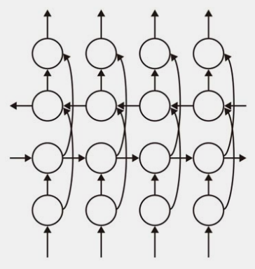

<!-- # やりたい事ノート -->
<!-- _class: title -->
<!-- _paginate: false -->

# やりたい事
<!-- _class: title -->
<!-- _paginate: false -->

## ラズパイ部

- クモを自分のコードで動かす
- CAD ＆ レーザーカットで新しい脚と顔をつくる
- 福袋の部品いろいろ試す
- ハンダごて買う

## AI実装

- ゼロつく実装[①](
https://github.com/oreilly-japan/deep-learning-from-scratch)[②](https://github.com/oreilly-japan/deep-learning-from-scratch-2)[③](https://github.com/oreilly-japan/deep-learning-from-scratch-3)[④](https://github.com/oreilly-japan/deep-learning-from-scratch-4)[⑤](https://github.com/oreilly-japan/deep-learning-from-scratch-5)
- 強化学習実装
- [AI実装検定](https://kentei.ai/)
  - 合格体験記的なやつを調査
  - 論文リストアップ
    - seq2seq
    - Transformer
    - HRED
    - Word2Vec (Skip-gram)
    - VGG
    - GoogLeNet
    - ResNet/WideResNet
    - MobileNet
    - EfficientNet
    - DenseNet

## 統計の勉強

- [統計検定２級](https://www.toukei-kentei.jp/)
-
-

## Marp関連

- mermaid試す（何ができるか）
- 16/9テーマ作成
- 背景画像テーマ作成

## 仕事関連

- タスク管理について学ぶ

## Notionから転記 **Wish list**

###### 焼き肉アプリ制作

###### 統計検定２級をとる

- まずは３級？
- [２級](https://www.toukei-kentei.jp/exam/grade2/)、
- [３級](https://www.toukei-kentei.jp/exam/grade3/)、

###### [AI実装検定](https://kentei.ai/)

###### Pythonでケミドロみたいな事

- RDkitを試す

##### 英語

- Readingの点数を伸ばす
- スラッシュリーディングの練習
- iknow続ける
- 暇なときにショート動画を見てしまう無駄時間に、代わりに英語ニュースのライブ配信を見る。
    [LIVE: NHK WORLD-JAPAN News](https://www.youtube.com/watch?v=f0lYkdA-Gtw)
    [ABC News](https://www.youtube.com/@ABCNews/streams)
    [LiveNOW from FOX](https://www.youtube.com/@livenowfox/streams)
    
###### 家計簿アプリリニューアル

- 

###### 砥石で包丁研ぐ

- ~~ルービックキューブ全面揃える~~
- キューブインキューブ

###### 母さんのアルバム整理

## アイデア

- バッチファイルでURLを開く、パスワードコピー
- ツイッターのいいねをNotionに取り込む
- 後で読むピックアップ時に、URLなどもif文にしてアイデアも書き込める様にする
- LINEボットにアイデアを投げたら、
- 集中するために必要なこと
    - このページを開く
    - 動画をとめて音楽にする。
        - [集中用プレイリスト](https://www.amazon.co.jp/music/player/my/playlists/e730d252-3557-414d-b684-fc664e832bf9)
        - 音量はできるだけ小さく、意識が音楽にフォーカスしない程度
    - 部屋を暗くしてみる。
    - カメラで自分の顔を映しながら勉強してみる。
    - 「今」やるべきことを書き出す
        - E資格の勉強
    - [勉強の記録](https://www.notion.so/82df1b28b8bd4b93867eef64ff682191?pvs=21)をつける
- [ ]  副業申請

## In Progress

### Qiitaにアウトプット

MDエディタ

### [リマインド機能付きのブックマーク集としてNotionデータベースを利用する](https://www.notion.so/Notion-59e190b0b52b4320967cbbfe4dac11b8?pvs=21)

### ラズパイ部の活動

[202303 なるせ（ラズパイデビュー＆ガチャガチャ動かしたい）](https://www.notion.so/202303-23b800a7b7a445efbb64b98b9a1dcb0f?pvs=21)

[ラズパイ部 部誌](https://www.notion.so/2beac71586a740b890e87e619e6db8f9?pvs=21)

[部室（Skype）](https://join.skype.com/wK2mGYOpXwct)

### [マナビDXクエスト](https://www.notion.so/DX-e716159871304693b22d70493f165378?pvs=21)

### 運動不足を解消する会

- ステッパー
- パワーボール
- スクワット

### [E資格の勉強](https://www.notion.so/E-9a2cac47ad3f4c6dbfd3e437c149b45b?pvs=21)

手書きのノートをスマホカメラで撮影後台形補正して画像として保存したい

- googleドライブはPDFになる

### [業務効率化アプリ作成](https://www.notion.so/bcca49c42b934eb1926653ad7277e4e4?pvs=21)

- PyInstallerでexe化してみた
- ドラッグでファイル名一覧取得
- ドラッグで拡張子なしファイル名一覧取得
- ドラッグでフルパス一覧取得
- ドラッグでPDFをページ毎に分割
- ドラッグでPDFを画像に変換
    - pdf2imageはPopplerユーティリティのインストールが必要
    - *PyMuPDF*
- 設計コピペでエクセル化アプリ
- 動画をgifにする

## DONE

### 自分の為のLineボット

### Lineボット基礎

[はじめてのLINEBOTの作り方　秘書ボットを作ろう](https://www.udemy.com/course/line-bot-x/)

- [Line Developpers](https://developers.line.biz/console/)
- [Google Apps Script（LB・ジェームス・プロジェクト）](https://script.google.com/home/projects/1oOvchfocqplpzwN_gIAfqwLhpG2lweN9uT-YXVI84Hxx-cbo0tPqSG1B/edit)
- [スクリプトプロパティの使い方](https://blog.take-it-easy.site/gas/using-script-properties-in-gas/)
- [ログエクスプローラ（GCP）の使い方](https://console.cloud.google.com/logs/query;cursorTimestamp=2024-01-03T02:29:59.674Z?authuser=0&project=lbjamesproject)
    - https://www.hidetoshl.com/gas-gcp/

### 後で読む仕組み作り

 

- Notion API
    -
- 手順
    1. ボットでリクエストを受け付ける
    2. データベースから記事のリストを取得する。
        - この時、読了チェック付きと、送信回数5回以上はフィルターで除く
    3. 記事のリストをページID、確率スコア、送信回数の配列に変換する。
        - 確率スコアは以下の様に計算
            - 作成日時（存在すれば送信日時）と現在日時の差（日数）を求める
                - 100日以上は100、20日未満は20とする。
            - 上記日数に対して5-送信回数を掛ける。
                - ただし、5-送信回数が0未満なら0とする。
    4. 上記スコア確率スコアの合計と乱数により、リストから記事IDを１つピックアップする。
        - 確率スコアの合計をとる。
        - 上記合計に0～1の乱数を掛ける
        - 上記から、for文でリスト要素の確率スコアを１つずつ引いていき、
        引けなくなった（残り確率スコアの方が小さくなった）ら、
        その要素のIDを返す。
    5. ピックアップした記事IDを使って、記事の内容をNotionAPIで取得する。
        - PATCHリクエストにより、取得と同時に以下の処理を行う
            - 送信回数を１増やす
            - 送信日時を、現在時刻に更新する
        - 記事のタイトル、URL、送信回数、作成日時、NotionのURLをLINE送信用のメッセージとして文字列にまとめる。
            - LINE送信（リプライ）を行う。

### [イレクターNEWデスク2023](https://www.notion.so/NEW-2023-8320425ee9594014895245a07a5833a4?pvs=21)

