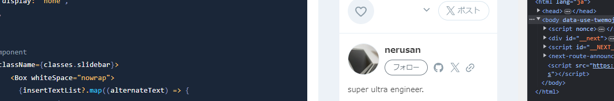
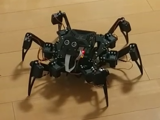

# ラズパイ部アウトプット（成瀬）
<!-- _class: title -->
<!-- _paginate: false -->

## ラズパイ部の活動

#### ブックマーク

- [202303 なるせ（ラズパイデビュー＆ガチャガチャ動かしたい）](https://www.notion.so/202303-23b800a7b7a445efbb64b98b9a1dcb0f?pvs=21)
- [ラズパイ部 部誌](https://www.notion.so/2beac71586a740b890e87e619e6db8f9?pvs=21)
- [部室（Skype）](https://join.skype.com/wK2mGYOpXwct)

## ラズパイ部でやりたい事

#### 前期振り返り

- ラズパイ初起動
- はじめてのLチカ → 仮装大賞マシン
- クモロボット「すぱいださん」大地に立つ  \
(本名：酢Pi田さん)

#### 今期やりたい事

- クモを自分のコードで動かす
- CAD ＆ レーザーカットで新しい脚と顔をつくる
- 福袋の部品いろいろ試す
- ハンダごて買う

# 第３期部誌転記

## ◆2ヶ月間の目標

#### 電子工作などの知識全然ないので、まずは既存のコースやキットに沿ったものを作ってみる

1. 購入したUdemyのコースを修了して、ラズパイの操作に慣れる  \
    [はじめてのRaspberry Piで作る！効果音・BGMプレーヤー「ラズパイサンプラー」](https://www.udemy.com/course/raspi-sampler/)  \
    セールで1200円でした。説明が丁寧で初心者にピッタリな講座だと思います。

2. 購入したロボットキットを組み立てる。ガチャガチャ動かす。  \
    [ラズパイで巨大ロボットを制御——人が搭乗できるスパイダー型多脚ロボット「MEGAHEX」｜fabcross](https://fabcross.jp/news/2023/20230412_raspberrypi_spiderrobot_megahex.html)  \
    ↑↑↑の記事を読んでクモ型ロボットいいなぁと思って探した結果

    ↓↓↓こいつに一目惚れして購入。￥18,980でした。  \
    [Freenove 大きなヘキサポッド ロボット キット Raspberry Pi 4 B 3 B+ B A+、ウォーキング、セルフバランス、ライブ ビデオ、顔認識、パン チルト、超音波測距、カメラ サーボ用 (Raspberry Pi は含まれていません)](https://www.amazon.co.jp/gp/product/B08M5DXS2P/ref=ppx_yo_dt_b_asin_title_o02_s00?ie=UTF8&psc=1)

## ◆2ヶ月の成果物

（あまり部誌をちゃんと更新できませんでしたすみません。。。）

##### ①仮装大賞風採点マシン

Udemy講座は修了しましたが、講座通りのサンプラーは最後までは作らず、こちらに応用しました。

[VID20231028194326 (2).mp4](https://prod-files-secure.s3.us-west-2.amazonaws.com/53c545b9-40b0-40d4-b82f-86ff1afd44dd/1d5d8ae7-9779-4fe3-a1da-71ea6e0e16d7/VID20231028194326_(2).mp4)

##### ②クモ型ロボット

まだキットのチュートリアル通りに作っただけですが、自分で組み立てたものがガシャガシャ動くのをみるとかなり感動します！

yorosiku

[VID20231117224535 (1).mp4](https://prod-files-secure.s3.us-west-2.amazonaws.com/53c545b9-40b0-40d4-b82f-86ff1afd44dd/3f7bdf5b-d307-4a18-906f-e5370df83947/VID20231117224535_(1).mp4)

[231118_084115.mp4](https://prod-files-secure.s3.us-west-2.amazonaws.com/53c545b9-40b0-40d4-b82f-86ff1afd44dd/71b8aeb4-b8d7-4c9c-a9bb-1b84706852bf/231118_084115.mp4)

##### ◆今後やりたいこと

- クモ型ロボットに名前を付ける。
- 自作パーツで足の長さを２倍にする
    - 現行の骨組みパーツはアクリル板をレーザーカットしたものっぽいので自作できそう。
    1. 現行の脚パーツを外して採寸
    2. CADで図面を描く
    3. アクリル板を買う
    4. レーザーカット
        - [ここ](https://co-box.info/access/)でレーザーカット借りられる
- 自律して動ける様にする
    - とりあえずコードをいじってみる
    -
- 声に反応するようにする

# ◆活動記録
