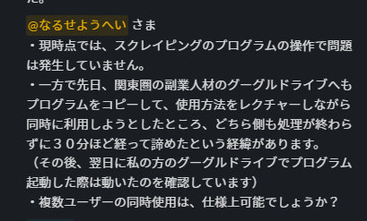
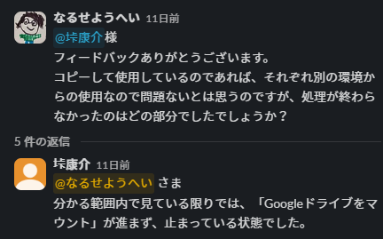
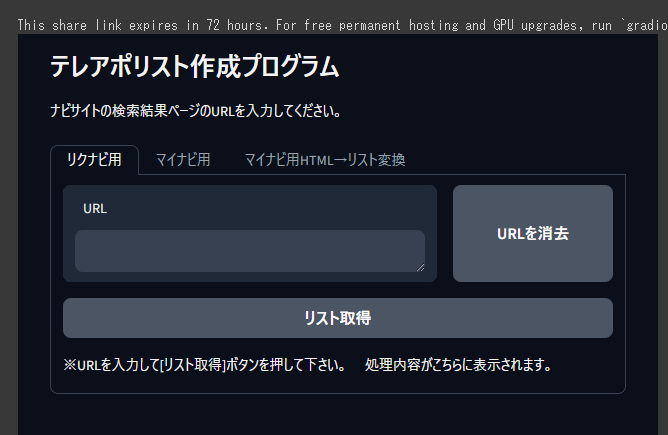

# Webスクレイピングについて

<!-- _class: title -->
<!-- _paginate: false -->

### 早起き同好会勉強会

#### 2024年03月14日

##### なるせようへい

## 内容
　　
#### トラブルシューティング

- 動作検証

#### 勉強会パート

- Webスクレイピングの概要
- Webスクレイピングの手法
- プログラム動作解説

## トラブルシューティング

#### 動作検証

###### googleドライブのマウント周辺の処理が終わらない



- 可能であれば不具合状況の再現をお願いします。
- [テレアポリスト作成プログラム](https://colab.research.google.com/drive/1EZkC1tRD60KzuEpD0mRvLZ3lUp1NujWT?usp=sharing#scrollTo=-UwKNoQw1E6d)

# Webスクレイピングの概要

## Webスクレイピングとは

#### どんな技術？

Webスクレイピングとは、Webサイトから任意の情報を抽出、整形、解析するための自動化技術の総称。¥
「スクレイピング（scraping）」という言葉通り「こそぎ取る」ようにデータを抽出することを意味する。

#### 何のため？

主にデータ収集や分析、競合調査などの目的で行われる。現代では大量かつ多様なデータがWeb上に公開されており、またそれらを収集・分析・活用する技術も発展している事から、スクレイピングを行う事でビジネスに有効な洞察を得られる可能性が高まっている。

#### 活用事例

市場調査、行動分析、まとめサイトや比較サイト作成の為のデータ収集、営業先候補の抽出などなど

## Webスクレイピングを行うリスク

#### 合法性に関するリスク

- **著作権侵害** ：著作物の無断収集・使用による訴訟リスク
- **利用規約違反** ：利用規約を無視した不正アクセスによる訴訟リスク

###### 対策：利用規約の確認、事前の許可取得など

#### 倫理に関するリスク

- **プライバシー侵害**：個人情報の無断収集による法的リスク
- **過剰なサーバ負荷**： 高頻度のアクセスでサーバに過剰な負荷をかけることによる障害発生、業務妨害罪に問われるリスク。

###### 対策：個人情報の扱いに注意する、アクセス頻度の調整、可能であればAPIを利用する

# Webスクレイピングの手法

## Webスクレイピングの手段

#### スクレイピングツール（ノーコード）

- [Octoparse](https://www.octoparse.jp/)、[ParseHub](https://www.parsehub.com/)、[Import.io](https://www.import.io/)などが人気。
- GUI操作でプログラミングの知識がなくてもWebスクレイピングができる事が大きなメリット。ただし、高度な処理はやはり操作が煩雑となる事や、かつ無料での使用には制限があることが多い。

#### プログラミング

- 無料で高度な処理を行う事が可能。
- 扱うプログラミング言語やライブラリの知識やスキルが必要となる。
- Python、JavaScript (Node.js)、Ruby、PHPがWebスクレイピングに向いている言語と言われている。
- Pythonは ①シンプルな構文でプログラミング初心者にも扱い易い ②Webスクレイピングに特化した強力なライブラリが豊富 ③機械学習やデータ分析と組み合わせた処理も容易などの特徴がある。

## WebスクレイピングのためのPythonライブラリ　1/2

##### requests

HTTPリクエストを行いWebサイトのコンテンツを取得したり、APIと通信する際に使用されます。

##### Beautiful soup 4

HTMLやXMLファイルからデータを抽出するためのライブラリ、タグの検索やデータの抽出を簡単に行うことができる。requestsと組み合わせて使用される事が多い。

##### Selenium

Webブラウザの自動化ツール。ブラウザの自動操作などに使用される。様々なブラウザでのスクリプト実行をサポートしている。

## WebスクレイピングのためのPythonライブラリ　2/2

##### Playwrite

Microsoftによる、ブラウザ自動化のためのライブラリ。Seleniumよりも現代的なAPIと多機能性を備える。複数のブラウザでのクロスブラウザテストに適している。

##### その他

Lxml： 高速なXML/HTML処理ライブラリ\
Scrapy： 強力なクローリングフレームワーク\
PyQuery： jQuery風のHTML解析ライブラリ

## Webスクレイピングの流れ

##### 1.データの取得

取得対象のWebページのHTMLをプログラム上で扱える形で取得する\
一般的にはHTTPリクエストを使用。Pythonではrequestsライブラリがよく使われる

##### 2.データの抽出

取得したHTMLから必要なデータを抽出するステップです。特定のHTMLタグやクラス、IDを指定してデータを抽出する。\
Pythonでは、BeautifulSoupやlxmlといったHTMLを解析するライブラリが使用される。

##### 3.データの整形

抽出したデータを分析や保存、表示に適した形式に整形する。\
例えば、テキストデータのクリーニング、日付や数値の形式の統一、JSONやCSVといったフォーマットへの変換などを行い、最終的に利用しやすい形にデータを加工する。

# プログラム動作解説

## リクエスト → 企業名などのリスト取得

##### リクナビの検索結果から、企業名、業種、本社所在地のリストを取得する

- [リクナビ検索結果ページ（愛媛県、キーワード「アニメ」）](https://job.rikunabi.com/2025/search/company/result/?k=38&ms=0&kk=0&rry=3&ggr=1&fw=%E3%82%A2%E3%83%8B%E3%83%A1)
- [サンプルプログラム](https://colab.research.google.com/drive/12PZ_RRn5y6AclMHQwPTqSlD8QFNbAiTP#scrollTo=PrYZOg8wvQCX)

###### 取得と保存だけのプログラム

```python
# ライブラリの読み込み
import requests

# URLを指定（リクナビで）
url = "https://job.rikunabi.com/2025/search/company/result/?k=38&ms=0&kk=0&rry=3&ggr=1&fw=%E3%82%A2%E3%83%8B%E3%83%A1"

# URLをGETリクエスト
response = requests.get(url)

# 取得した内容を取り出す
html_content = response.text

# テキストファイルに保存
file_path = 'scraped_content.txt'
with open(file_path, 'w', encoding='utf-8') as file:
    file.write(html_content)
```

---

#### scraped_content.txt

- この**取得**したデータから、企業名などを**抽出**し、**整形**（リスト化）していく流れを実演で説明します。


## 営業リスト作成プログラムの解説（時間があれば）

- 時間があれば、テレアポリスト作成プログラムの処理の流れについて解説します。
- [テレアポリスト作成プログラム](https://colab.research.google.com/drive/1EZkC1tRD60KzuEpD0mRvLZ3lUp1NujWT?usp=sharing#scrollTo=-UwKNoQw1E6d)


