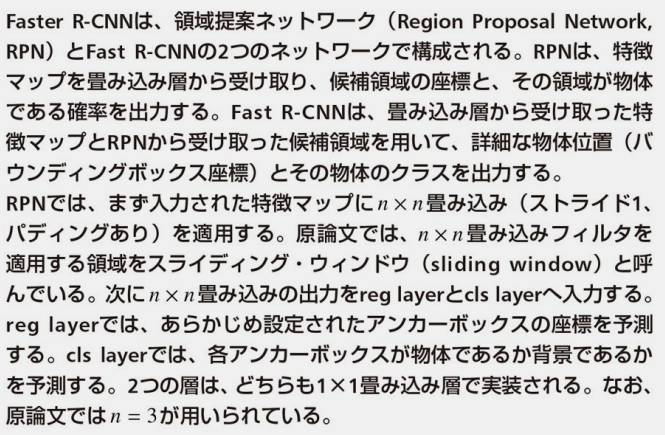
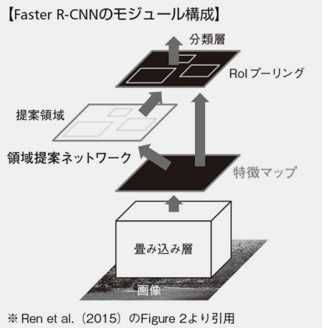
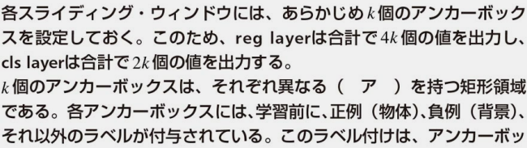
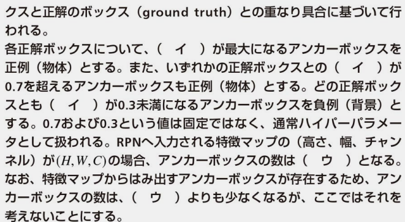
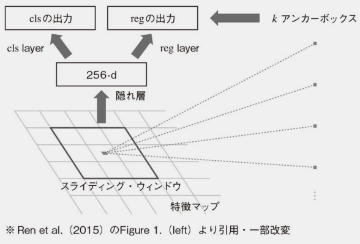
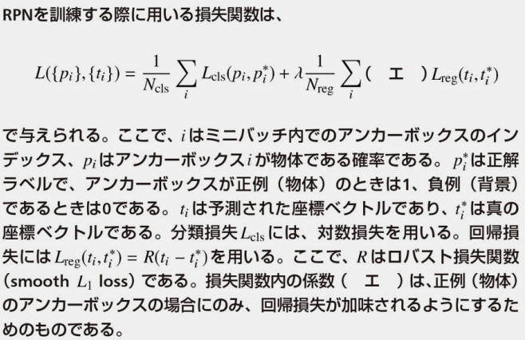
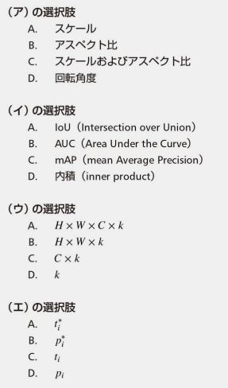

## 黒本13章 問6 物体検出に関する問題

<!-- ___◆問題___ -->

<u>物体検出とは</u>

ある画像中における
- 物体の位置
- その物体に対応するクラス
  
を予測する。

<u>物体検出における教師データ</u>

- **（ア）物体が含まれる矩形領域**を示すバウンディングボックス(正解はA)
- その物体に対応するクラス

<u>１つの物体に複数のバウンディングボックスが検出された場合に、バウンディングボックスを１つに限定する処理</u>

- **（イ）非最大値抑制 (non-maximum suppression)**(正解はA)

<u>IoU　バウンディングボックスの一致度を測る指標</u>

式

わかり易い図\

[物体検出の評価指標IoUの計算方法](https://qiita.com/shoku-pan/items/35eae224c59989957623)

（ウ）の計算\

<!-- $$ IoU =\frac{共通領域の面積}{２つの領域の和集合の面積}=\frac{150 \times 200}{(300\times400)+(300\times400)-(150 \times 200)} = 0.14 $$ -->

正解はB

<u>AP クラスの一致度を測る指標</u>

（エ）の計算\

<!-- 

 -->

<!-- ___◆解答___

 -->

## 黒本13章 問7

___◆問題___

<!--  -->

1. R-CNN (Region-Based Convolutional Neural Network):\
R-CNNは、物体検出の初期の試みの1つで、以下の手順で動作します。
画像から候補領域（region proposal）を生成するアルゴリズム（通常はSelective Search）を使用して、検出対象の領域を候補として抽出します。
各候補領域を切り抜き、リサイズして固定サイズの入力画像に変換します。
CNNを使用して、各候補領域に対して特徴抽出を行し、それらの特徴を分類するためのSVM（Support Vector Machine）を使用して物体のクラスを予測します。\
（ア）の正解：\

- R-CNNは物体検出の性能を向上させましたが、処理速度が遅かったため、高コストでした。

2. Fast R-CNN:\
Fast R-CNNは、R-CNNの高速化と統合を図った改良版です。
候補領域の生成と特徴抽出を統合し、一度のCNNパスで処理します。
候補領域の位置を回帰モデルを使用して修正し、物体の位置をより正確に予測します。\
（イ）の正解：\

- Fast R-CNNはR-CNNに比べて高速で、精度も向上しましたが、候補領域の生成にはSelective Searchなどの遅いアルゴリズムが使用されていたため、全体的な処理速度はまだ改善の余地がありました。

3. Faster R-CNN:\
Faster R-CNNは、候補領域の生成プロセスをエンドツーエンドでニューラルネットワークで処理することを可能にし、物体検出の高速化と精度向上を実現しました。
候補領域の生成を担当するRPN（Region Proposal Network）と呼ばれるネットワークを導入し、候補領域の生成と特徴抽出を一体化させました。
RPNは画像の畳み込み特徴マップを入力とし、候補領域の提案を効率的に生成します。\
（ウ）の正解：\

<!-- ___◆解答___

 -->

## 黒本13章 問8

___◆問題___

正解は
- （ア）がBのYOLO
- （イ）がAのSSD

1. SSD (Single Shot MultiBox Detector):\
SSDは、物体検出（object detection）のためのコンピュータビジョンモデルです。SSDは、画像内の複数の物体を同時に検出し、それぞれの物体の位置とクラスを特定することができます。SSDは、リアルタイムの物体検出タスクに適しており、異なるサイズとアスペクト比の物体を効率的に検出できます。このモデルは、2つの主要なコンポーネントである物体位置の回帰とクラス分類を組み合わせて使用します。\

2. YOLO (You Only Look Once):\
YOLOも物体検出のためのモデルで、画像内の物体を同時に検出し、位置とクラスを特定します。YOLOは高速でリアルタイムの物体検出に優れており、単一のニューラルネットワークを使用して検出と分類を同時に行います。YOLOのアーキテクチャはバージョンごとに進化しており、YOLOv3、YOLOv4、YOLOv5などが存在します。\

3. U-Net:\
U-Netは、セマンティックセグメンテーション（semantic segmentation）と呼ばれるタスクのためのディープラーニングモデルです。セマンティックセグメンテーションは、画像内の各ピクセルを異なるクラス（物体や背景など）に割り当てるタスクです。U-Netは、エンコーダー（画像の特徴を抽出する部分）とデコーダー（特徴マップを元の解像度に戻す部分）から構成されるユニークなアーキテクチャを持っており、セグメンテーションタスクに適しています。

4. ResNet (Residual Neural Network):\
ResNetは、ディープラーニングモデルのアーキテクチャであり、非常に深いニューラルネットワークを効果的に訓練するためのイノベーションを導入しました。通常、深いネットワークを訓練しようとすると、勾配消失問題が発生し、性能が低下しますが、ResNetは残差ブロック（residual block）と呼ばれる構造を使用してこの問題を解決しました。ResNetは、非常に深いネットワークで高い精度を実現し、画像認識などの多くのコンピュータビジョンタスクで広く使用されています。

___◆解答___

## 黒本13章 問9

___◆問題___

___◆解答___

<!-- 

## 黒本13章 問10

___◆問題___

___◆解答___

## 黒本13章 問11

___◆問題___

___◆解答___

 -->