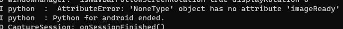

<!-- _class: lead -->

# 学習メモ

## 7/9 → 7/29

---

# 目次

<style 'scoped'>ul{width: 90%;  height: 60%;  overflow: auto;}</style>

## 以下、自動生成した目次
<!-- この下でTOC作成を実行 -->
- [学習メモ](#学習メモ)
  - [7/9 → 7/15](#79--715)
- [目次](#目次)
- [メモ](#メモ)
  - [7/13](#713)
    - [TODO](#todo)
  - [7/12](#712)
  - [7/11](#711)
  - [6/10](#610)
    - [アプリがカメラオンオフで落ちる件](#アプリがカメラオンオフで落ちる件)
      - [修正後](#修正後)
      - [修正前](#修正前)
    - [Camera4Kivyの仕様について](#camera4kivyの仕様について)
      - [Previewウィジェットの仕様](#previewウィジェットの仕様)
- [リンク集](#リンク集)
- [目標](#目標)
  - [7/15までにやる事リスト](#715までにやる事リスト)
- [アウトプット](#アウトプット)
  - [アウトプットしたい事リスト](#アウトプットしたい事リスト)
- [ディープラーニングフレームワーク](#ディープラーニングフレームワーク)
  - [◆モバイル/エッジデバイス向けフレームワーク比較](#モバイルエッジデバイス向けフレームワーク比較)
    - [※推論の実装にPythonが使えるものを抜粋](#推論の実装にpythonが使えるものを抜粋)

---

# メモ

## 7/26

### テスト

---

## 7/13

### TODO

- Tensorflow Liteでの推論の実装
  - Page 3のコピーPage 4を作る
  - Page 4のボタンを推論実行ボタン１つにする
  - 推論実行関数の定義
    - 画像読み込み（コールバックで渡されたパスのまま使えるか？）
      - 無理ならアプリ直下に保存する方法も確認する
    - 画像変換

---

<style 'scoped'>
pre{width:80%;max-height:60%;margin:1% 10%;background-color:black;color:gray;overflow:auto;font-size:.9em;white-space:pre-wrap;word-wrap:break-word;}
pre::part(auto-scaling) {max-height:initial;}
</style>

``` Python
    def capture(self):
        self.camera_ref.export_as_image().texture.save('temp.png')
        image = Image.open('temp.png').convert('RGB')
        print(type(image))
        pred, animalNameProba_ = predict(image)
        animalName_ = getName(pred)
        show_toast(str(animalName_) + str(animalNameProba_))
```

```Python
# 必要なモジュールのインポート
from torchvision import transforms
import pytorch_lightning as pl
import torch.nn as nn
#学習時に使ったのと同じ学習済みモデルをインポート
from torchvision.models import resnet18 

# 学習済みモデルに合わせた前処理を追加
transform = transforms.Compose([
    transforms.Resize(256),
    transforms.CenterCrop(224),
    transforms.ToTensor(),
    transforms.Normalize(mean=[0.485, 0.456, 0.406], std=[0.229, 0.224, 0.225]),
])

#　ネットワークの定義
class Net(pl.LightningModule):

    def __init__(self):
        super().__init__()

        #学習時に使ったのと同じ学習済みモデルを定義
        self.feature = resnet18(pretrained=True) 
        self.fc = nn.Linear(1000, 2)

    def forward(self, x):
        #学習時に使ったのと同じ順伝播
        h = self.feature(x)
        h = self.fc(h)
        return h
```

---

<style 'scoped'>
pre{width:80%;max-height:60%;margin:1% 10%;background-color:black;color:gray;overflow:auto;font-size:.9em;white-space:pre-wrap;word-wrap:break-word;}
pre::part(auto-scaling) {max-height:initial;}
</style>

```Python
# 学習済みモデルをもとに推論する
def predict(img):
    # ネットワークの準備
    net = Net().cpu().eval()
    # # 学習済みモデルの重み（dog_cat.pt）を読み込み
    # net.load_state_dict(torch.load('./src/dog_cat.pt', map_location=torch.device('cpu')))
    net.load_state_dict(torch.load('./src/dog_cat.pt', map_location=torch.device('cpu')))
    #　データの前処理
    img = transform(img)
    img =img.unsqueeze(0) # 1次元増やす
    #　推論
    y = torch.argmax(net(img), dim=1).cpu().detach().numpy()
    y_pred_proba = round((max(torch.softmax(net(img), dim=1)[0]) * 100).item(),2)
    return y, y_pred_proba


#　推論したラベルから犬か猫かを返す関数
def getName(label):
    if label==0:
        return '猫'
    elif label==1:
        return '犬'
```

```python
# pylint: disable=g-import-not-at-top
try:
  # Import TFLite interpreter from tflite_runtime package if it's available.
  from tflite_runtime.interpreter import Interpreter
  from tflite_runtime.interpreter import load_delegate
except ImportError:
  # If not, fallback to use the TFLite interpreter from the full TF package.
  import tensorflow as tf

  Interpreter = tf.lite.Interpreter
  load_delegate = tf.lite.experimental.load_delegate
```

---

## 7/12

- filepath_callbackで保存場所を取得したい。
  - できた。Previewクラス内に関数(メソッド)を定義して、connect_camera実行時に`filepath_callback = self.mymethod`を指定する

## 7/11

- 透明シャッターボタンの実装
  - Gridlayoutでボタンを並べて、ボタンの色を透明にし、文字だけ表示した

## 6/10

### アプリがカメラオンオフで落ちる件

- camera4kivyのself._cameraがNoneTypeなのでimageReadyが使えない。

- 以下の様にしたら直ったが、なぜAndroidで修正後のコードが落ちるのか不明

<style 'scoped'>
pre{width:80%;max-height:60%;margin:1% 10%;background-color:black;color:gray;overflow:auto;font-size:.9em;white-space: pre-wrap;word-wrap: break-word;}
pre::part(auto-scaling) {max-height:initial;}
</style>

#### 修正後

```Python
    def play(self):
        if self.camera_connected == False:
            show_toast('カメラへの接続を試みます')
            self.connect_camera(enable_analyze_pixels = True, enable_video = False)
        else:
            show_toast('カメラを切断します')
            self.disconnect_camera()
```

#### 修正前

```Python
    def play(self):
        global Flg
        Flg = not Flg
        show_toast(f'{Flg}だよう')

        if Flg == True:
            self.connect_camera(enable_analyze_pixels = True, enable_video = False)

        else:self.disconnect_camera()
```

### Camera4Kivyの仕様について

#### Previewウィジェットの仕様

- `.camera_connecter`でカメラに接続しているかどうかを`true`, `false`で取得できる。
- capture_photo(subdir='subdir')とする事で、画像フォルダ内のsubdirフォルダに写真を保存してくれる。ただし、いきなり二重構造を作ろうとするとmkdirが失敗するためエラーになる。（mkdirに-pを指定すれば可能？）
- Androidでは二重構造作成可能だった
- filepath_callbackで保存場所を取得したい。
- 設定をどう保存するか？
- 透明シャッターボタンの実装

---

# リンク集

- [チーム学習ワークシート](https://docs.google.com/spreadsheets/d/13ku4cnnYXjrX5Dry_6ppwHeV9Bd_GShm7CiodEAkjwc/edit#gid=233889954)
- [c4k_tflite_example](https://github.com/Android-for-Python/c4k_tflite_example)
- [Camera4Kivy](https://github.com/Android-for-Python/Camera4Kivy#camera4kivy)
- [TensorFlow Lite](https://www.tensorflow.org/lite?hl=ja)
- [PyTorch Mobile](https://pytorch.org/mobile/home/)

---

# 目標

## 7/15までにやる事リスト

- Githubの読み解く
- アプリUIほぼ完成させる
  - Android上のデータ保存方法
  - ObjectDetection
  - PTファイルをtfliteファイルに変換
  - 犬猫分類カメラを完成させる
- 画像特化コース受講
- マナビDXクエスト申し込み

---

# アウトプット

## アウトプットしたい事リスト

- Git branchの使い方
- Marpの使い方

---

# ディープラーニングフレームワーク

## ◆モバイル/エッジデバイス向けフレームワーク比較

### ※推論の実装にPythonが使えるものを抜粋

|                | TensorFlow Lite                                           | ONNX Runtime                                            | Edge TPU (Coral)                                      | Paddle Lite                                           |
|----------------|------------------------------------------------------------|---------------------------------------------------------|--------------------------------------------------------|-------------------------------------------------------|
| 初リリース年    | 2017                                                       | 2019                                                     | 2019                                                    | 2019                                                   |
| 開発元         | Google                                                      | Microsoft                                                | Google                                                  | PaddlePaddle                                          |
| Pythonでのエッジデバイス/モバイル推論 | はい                                                         | はい                                                      | はい (Edge TPU専用のハードウェア必要)                    | はい                                                    |
| 公式ドキュメント | [TensorFlow Lite](https://www.tensorflow.org/lite/guide)  | [ONNX Runtime](https://onnxruntime.ai/docs/)            | [Coral](https://coral.ai/docs/)                        | [Paddle Lite](https://paddle-lite.readthedocs.io/en/latest/) |
| 主な特徴        | TensorFlowモデルの軽量化・最適化。モバイル・エッジデバイス対応。 | 広範なプラットフォームとフレームワーク対応。ONNXモデル高速実行。 | TensorFlow LiteモデルをGoogle Edge TPUで高速実行。専用ハードウェア必要。 | PaddlePaddleフレームワークの軽量版。モバイル・エッジデバイス対応。 |
