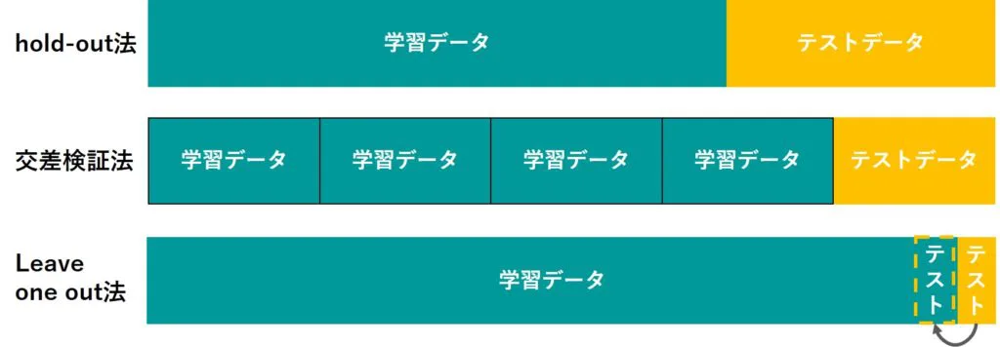

<!-- 
marp: true
headingDivider: 1
theme: A4-Manual
paginate: true
footer: E資格範囲の数式まとめ
-->

# E資格黒本１９章

### 1. 固有値分解（6問）

### 2. ベルヌーイ分布の平均、分散、負の対数尤度関数（3問）

### 3. ベイズの定理（3問）

### 4. KLダイバージェンス、交差エントロピー（3問）

### 5. 二乗和誤差、対数尤度関数（4問）

### 6. 機械学習（4問）

### 7. 汎化誤差、ホールドアウト法、交差検証法、ハイパーパラメーター、グリッドサーチ（5問）


---

### 8. k-means実装（5問）
- argがつくとindexを返す
- 関数名の意味を理解してればピンとくる？ 
    


### 9. サポートベクトルマシン（3問）
- 外れ値の影響受けにくい　ロバスト
- 

### 10. シグモイド関数（4問）

### 11. 正則化

- 式覚える
- スパースの意味

--- 

### 12. 確率的勾配降下法の実装（4問）

- `train_size // batch_size` の// は、割り算の結果を小数点以下切り捨てて整数値を返す。
- numpyの出そうな関数まとめる
- パラメーター更新式を覚える。

### 13. Adam 実装（4問）
 - 式覚える
$$\begin{align}
&m_{t+1} = \rho_1 m_t + (1-\rho_1)\frac{\partial L}{\partial \theta_t}\\
&v_{t+1} = \rho_2 v_t + (1-\rho_2)\frac{\partial L}{\partial \theta_t}\odot \frac{\partial L}{\partial \theta_t}\\\\
&\hat m_{t+1} = \frac{m_{t+1}}{1-\rho_1^t}\\
&\hat v_{t+1} = \frac{v_{t+1}}{1-\rho_2^t}\\\\
&\theta_{t+1} = \theta_t - \eta\frac{1}{\sqrt{\hat v_{t+1}}+\varepsilon}\odot \hat m_{t+1}
\end{align}$$

---

### 14. バッチ正規化（7問）

### 15. 勾配降下法（5問）

### 16. 畳み込みとプーリング（2問）

### 17. im2col実装（4問）

---

### 18. 代表的CNNモデル（3問）

### 19. 物体検出モデル（3問）

### 20. セマンティックセグメンテーション（1問）

### 21. 畳み込みのパラメータ（3問）


---

### 22. GRU （5問）

### 23. RNN 派生モデル（2問）

### 24. word2vec（2問）

### 25. BLEU（1問）

### 26. VAE（1問）

### 27. GAN（1問）

### 28. DQN（2問）


---

### 29. 方策勾配法、Sarsa、Q学習（3問）

### 30. 性能指標（1問）

### 31. GNMT（1問）

### 32. BERT（1問）

### 33. WaveNet（1問）

### 34. 軽量化（蒸留、剪定、量子化）（1問）

---

### 35. ディファインアンドラン、ディファインバイラン（1問）

### 36. GPU（1問）

### 37. 分散深層学習（1問）


---


# 固有方程式  
<!-- _header: 線形代数 -->

$$ \large \det (\lambda I - A) = 0$$
###### 各要素の意味など
- $\det$　は行列式(determinant) を意味する。 <br> $\left| \begin{array}{cc} \lambda I - A \end{array} \right| =0$　と表現される事もある。
- $\lambda$　は固有値
- $I$　は単位行列
- $A$　はn次正方行列


# 特異値分解

$$ \large A = U\Sigma V^T $$
###### 各要素の意味など
- $A$　は
- $U$　は
- $\Sigma$　は
- $V^T$　は
- 


# ベルヌーイ分布

$$ \large f(x;p) = p^x(1-p)^{1-x} $$
###### 各要素の意味など
- $x$　は成功か失敗を表す変数（$k$で表されることもある？）
- $p$　は単一試行での成功確率
- $f(x;p)$　はベルヌーイ分布の**確率質量関数**で、パラメータ$p$が与えられた時の変数$x$の関数という意味
	- $x=1$ の場合、 $p^x=p$ となり $(1-p)^{1-x} = 1$ となるため、<center>$f(x;p)=p$</center>
	- $x=0$ の場合、 $p^x=1$ となり $(1-p)^{1-x} = 1-p$ となるため、<center>$f(x;p)=1-p$</center>
- $p$の$x$乗の様な表現はただのモデル化であり物理的プロセスや現象を直接表現しているわけではない？（「こうするとうまく表現できる」以上の深い意味はない？）


# ベルヌーイ分布の期待値

$$\large\begin{align}\mathbb{E}[X] &= \sum_{x=0}^{1}xp^x(1-p)^{1-x} \\\\&= p\end{align}$$
###### 各要素の意味など
- $\mathbb{E}[X]$は


# ベルヌーイ分布の分散

$$\large\begin{align}Var[X] &= \mathbb{E}[(X-\mathbb{E}[X])^2)] \\
  Var[X] &= \mathbb{E}[X^2]-\mathbb{E}[X]^2 \\
  &= \sum_{x=0}^{1}x^2p^x(1-p)^{1-x}-p^2 \\
  &= p-p^2\\&=p(1-p)\end{align}$$
###### 各要素の意味など
- 


# マルチヌーイ分布（カテゴリ分布）

$$\large{f(x;p) = \prod_{j=1}^{k}p_j^{x_j}}　\\(ただし、\sum_{j=1}^{k}p_j =1、0\le p_j \le 1、j=1,....)$$

###### 各要素の意味など
- 


# マルチヌーイ分布の負の対数尤度（カテゴリ分布）

$$\large\begin{align} -\log L_D (p) &= -\log\prod_{i=1}^{n}f(x_i;p)　 \\
  &= -\sum_{i=1}^{n}\log\prod_{j=1}^{k}p_j^{x_{ij}} \\
  &= -\sum_{i=1}^{n}\sum_{j=1}^{k}\log p_j^{x_{ij}} \\
  &= -\sum_{i=1}^{n}\sum_{j=1}^{k}x_{ij}\log p_j
  \end{align}$$
###### 各要素の意味など
- 


# 正規分布

$$\large f(x; \mu,\sigma^2) = \frac{1}{\sqrt{2\pi\sigma^2}}\exp\left(-\frac{1}{2\sigma^2}(x-\mu)^2\right)$$
###### 各要素の意味など
- 


# 正規分布の負の対数尤度

$$\large\begin{align} L(\mu) &= \prod_{i=1}^{n}f(x_i;\mu)\\
&=\prod_{i=1}^{n}\frac{1}{\sqrt{2\pi}}\exp\left(-\frac{1}{2}(x_i-\mu)^2\right)\\
 -\log L(\mu) &= -\log \left(\prod_{i=1}^{n}\frac{1}{\sqrt{2\pi}}\exp\left(-\frac{1}{2}(x_i-\mu)^2\right)\right)\\
&=-\sum_{i=1}^{n}\log\left(\frac{1}{\sqrt{2\pi}}\exp\left(-\frac{1}{2}(x_i-\mu)^2\right)\right)\\
&=-\sum_{i=1}^{n}\left(\log\left(\frac{1}{\sqrt{2\pi}}\right)-\frac{1}{2}(x_i-\mu)^2\right)\\
&=-n\log\left(\frac{1}{\sqrt{2\pi}}\right)-\frac{1}{2}\sum_{i=1}^{n}(x_i-\mu)^2\\
\end{align}$$
###### 各要素の意味など
- 
a


# 正規分布の最尤推定
$$\large\begin{align}
\frac{d}{d\mu}g(\mu) &= \frac{1}{2}\sum_{i=1}^{n}\frac{d}{d\mu}(x_i-\mu)^2\\
&= \frac{1}{2}\sum_{i=1}^{n}(-2(x_i-\mu))\\
&= \sum_{i=1}^{n}\mu-\sum_{i=1}^{n}x_i\\
&= n\mu-\sum_{i=1}^{n}x_i\\
\end{align}$$

$$\large\hat\mu = \frac{1}{n}\sum_{i=1}^{n}x_i$$


###### 各要素の意味など
- 


# エントロピー
$$\large H(X) = -\sum_{x}p(x)\log_2p(x)$$

###### 各要素の意味など
- 


# 交差エントロピー(クロスエントロピー)の定義
$$\large H(p,q) = -\sum_{x}p(x)\log_2q(x)$$
###### 各要素の意味など
- $p(x)$　真の(正解の)確率分布
- $q(x)$　推定したモデルの確率分布


# 二値交差エントロピー(バイナリクロスエントロピー)　※1/8追加※
$$\large D_{BC} = -P(x=0)\log Q(x=0)-(1-P(x=0))\log(1-Q(x-0))$$
###### 各要素の意味など
- $p(x)$　真の(正解の)確率分布
- $q(x)$　推定したモデルの確率分布


# KLダイバージェンス
$$\large D(p||q) = \sum_{x}p(x)\log_2\frac{p(x)}{q(x)}$$


###### 各要素の意味など
- 


# JSダイバージェンス
$$\large D_{JS}(p||q) = \frac{1}{2}\left(\sum_{x}p(x)\log_2\frac{p(x)}{r(x)}+\sum_{x}q(x)\log_2\frac{q(x)}{r(x)}\right)$$
$$\large r(x) = \frac{p(x)+q(x)}{2}$$


###### 各要素の意味など
- 


# ベイズの定理
$$\large p(C|x) = \frac{p(x|C)p(C)}{p(x)}$$


###### 各要素の意味など
- 


# バイアス・バリアンス・ノイズ
$$\large\mathbb{E}(L) = \int\{y(x)-h(x)\}^2p(x)dx +\iint\{h(x)-t\}^2p(x,t)dxdt$$

$$\large\begin{align}
&\int\{\mathbb{E}_D[y(x;D)] - h(x)\}^2p(x)dx \\
&\int\mathbb{E}_D[\{y(x;D) - \mathbb{E}_D[y(x;D)]\}^2p(x)dx \\
&\iint\{h(x) - t\}^2p(x,t)dxdt \\
\end{align}$$


###### 各要素の意味など
- 

# オッズ
<!-- _header: テスト --->
$$\large \frac{p(y=1|x)}{p(y=0|x)}=\frac{\hat y}{1-\hat y}$$

$$\large\begin{align}
\frac{\hat y}{1-\hat y} &= \frac{\frac{1}{1+\exp(-w^Tx-b)}}{1-\frac{1}{1+\exp(-w^Tx-b)}}\\
&= \frac{1}{(1+\exp(-w^Tx-b))-1}\\
&= \frac{1}{\exp(-w^Tx-b)}\\
&= \exp(w^Tx-b)
\end{align}$$


###### 各要素の意味など
- 


# ガウスカーネル
<!-- _header: 　 --->
$$\large k(x,x')=\exp\left(-\frac{||x-x'||^2}{\beta}\right)$$


###### 各要素の意味など
- 


# 正則化
<!-- _header: 　 --->
$$\large\begin{align}
&E+\lambda_2||w||_2^2 \\
&E+\lambda_1||w||_1 \\
&E+\lambda_1||w||_1+ \lambda_2||w||_2^2
\end{align}$$


###### 各要素の意味など
- 


# シグモイド関数
<!-- _header: 活性化関数 --->
$$\large f(x) = \frac{1}{1+\exp(-x)}$$


###### 各要素の意味など
- 初期の活性化関数
- 微分しやすい
- 層数が多いNNでは勾配消失が起こりやすいため、近年あまり使われていない
- どんな入力値に対しても0<y<1 の範囲をとる
- $\exp(-x)$ は $e^{-x}$ の意、x=0の時1となるため、$f(x)=\frac{1}{2}$となる
- 


# ReLU関数
<!-- _header: 活性化関数 --->
$$\large f(x) = \max(0,x)$$

```
np.maximum(0, x)
```


###### 各要素の意味など
- ニューラルネットワークの活性化関数
- max(0,x)なので、y=xとy=0のうち大きい方という意味
- x=0の時は微分できない
- 


# ソフトマックス関数
<!-- _header: 活性化関数 --->

<!-- _headingDivider: 2 --->

$$\large \text{softmax}(z)_i=\frac{\exp(z_i)}{\Sigma_j\exp(z_j)}$$
$$\large y_i=\frac{e^{x_i}}{e^{x_1}+e^{x_2}+ \cdots+e^{x_n}} \hspace{30px}(i=1,\cdots,n)$$


```
np.exp(z) / np.sum(np.exp(z))
```

###### 各要素の意味など
- 分類問題の確率分布を表す為に使用
- i=1~nの場合それぞれの出力値の合計が1になる


# 二乗和誤差
<!-- _header: 損失関数--->
$$\large \frac{1}{2}\sum_{k=1}^{K}(y_k-t_k)^2$$

$y_k$で偏微分すると、k=1~Kのうちk番目以外の項が0になるため
$$\large y_k-t_k$$


###### 各要素の意味など
- 損失関数の１つ
- $y_k-t_k$は予測値と正解値との誤差。二乗することで必ず正の値になるようにしている。


# 生成モデル
<!-- _header: none --->
$$\large p(y|x)p(x) = \frac{p(x,y)}{p(x)}\cdot p(x) = p(x,y)$$


###### 各要素の意味など
- 


# ベルマン方程式
<!-- _header: 　 --->
$$\large\begin{align}
V^\pi(s) &= \mathbb{E}[G_t|S_t = s]\\\\
&= \mathbb{E}[R_{t+1}+\gamma G_{t+1}|S_t = s]\\\\
&= \sum_a\pi(a|s)\sum_{s',r}P(s',r|s,a)[r+\gamma\mathbb{E}_\pi[G_{t+1}|S_{t+1} = s']]\\\\
&= \sum_a\pi(a|s)\sum_{s',r}P(s',r|s,a)[r+\gamma V^\pi(s')]
\end{align}$$

$$\large\begin{align}
Q^\pi(s,a) &= \mathbb{E}[R_{t+1}+\gamma V^\pi(S_{t+1})|S_t = s,A_t = a]\\
&= \sum_{s',r}P(s',r|s,a)[r+\gamma V^\pi(s')]
\end{align}$$

###### 各要素の意味など
- 


# SARSA
<!-- _header: 　 --->
$$\large Q(S_t,A_t) \leftarrow Q(S_t,A_t)+\alpha[R_{t+1} + \gamma Q(S_{t+1},A_{t+1})-Q(S_t,A_t)] $$


###### 各要素の意味など
- 


# Q学習
<!-- _header: 　 --->
$$\large Q(S_t,A_t) \leftarrow Q(S_t,A_t)+\alpha\left[R_{t+1} + \gamma \max_{a'}Q(S_{t+1},a')-Q(S_t,A_t)\right] $$


###### 各要素の意味など
- 


# 方策勾配定理
<!-- _header: 　 --->
$$\large\begin{align}
&\nabla_\theta J(\theta) = \sum d^{\pi_\theta}(s) \sum \nabla_\theta\pi_\theta(a|s,\theta)Q^{\pi_\theta}(s,a) \\
&\nabla_\theta\log \pi_\theta(a|s) = \frac{\partial\pi_\theta(a|s)}{\partial\theta}\frac{1}{\pi_\theta(a|s)} \\
&d^{\pi_\theta}(s) = \sum_{k=0}^{\infty}\gamma^kP^{\pi_\theta}(s_k=s|s_0) 
\end{align}$$
$$\large\begin{align}
\nabla_\theta J(\theta) &= \sum d^{\pi_\theta}(s) \sum_a( \nabla_\theta\pi_\theta(a|s,\theta))Q^{\pi_\theta}(s,a) \\
&= \sum d^{\pi_\theta}(s) \sum_a\pi_\theta(a|s,\theta)( \nabla_\theta\log\pi_\theta(a|s,\theta))Q^{\pi_\theta}(s,a) \\
&= \mathbb{E}_{\pi_\theta}[\nabla_\theta\log\pi_\theta(a|s,\theta)Q^{\pi_\theta}(s,a)] \\
\end{align}$$


###### 各要素の意味など
- 


# モンテカルロ近似
<!-- _header: 　 --->
$$\large
\nabla_\theta J(\theta) = \mathbb{E}_{\pi_\theta}[f(s,a)] \approx \frac{1}{N}\sum_{n=1}^{N}\frac{1}{T}\sum_{t=1}^{T}\nabla_\theta\log\pi_\theta(a_t^n|s_t^n)Q^{\pi_\theta}(s_t^n, a_t^n)
$$


###### 各要素の意味など
- 


# 交差エントロピー誤差（多クラス分類）
<!-- _header: 損失関数--->
$$\large E = -\frac{1}{N}\sum_{n}\sum_{k}t_{nk}\log y_{nk}$$


###### 各要素の意味など
- $N$：データ個数（サンプル数）
- $k$：データの次元数（クラス数？）


# アフィンレイヤ
<!-- _header: 全結合型ニューラルネットワーク --->
$$\large H = XW + B$$
コード
```
# アフィン変換
affine[i] = np.dot(activations[i], self.coefs_[i]) + self.intercepts_[i]
```

重みの勾配
$$\large \frac{\partial L}{\partial W} = X^T\frac{\partial L}{\partial H}$$
入力の勾配
$$\large \frac{\partial L}{\partial X} = \frac{\partial L}{\partial H}W^T$$
```
# 入力(activations)の勾配を算出
deltas[i - 1] = np.dot(deltas[i], self.coefs_[i].T)
```


###### 各要素の意味など
- X: 入力データ。
- W: 重み行列。
- B: バイアスベクトル。


# 確率的勾配降下法（SGD）
<!-- _header: 最適化アルゴリズム--->
パラメータ更新式
$$\large \theta_{t+1} = \theta_t- \eta\frac{\partial L}{\partial \theta_t}$$
```
params[key] = params[key] - self.lr * grads[key]

# -=を使って下記の様に短く書ける
params[key] -= self.lr * grads[key]
```

###### 各要素の意味など
- $\eta$は学習率
- $\theta$はパラメータ、$\theta_{t}$は更新前$\theta_{t+1}$が更新後
- $\frac{\partial L}{\partial \theta_t}$はパラメータの勾配


# モーメンタム
<!-- _header: 最適化アルゴリズム--->
- 更新速度の項を導入する事で勾配降下法よりも、谷での収束が早くなる
	- 同じ方向に進もうとする → 加速する
	- 逆の方向に進もうとする → ブレーキをかける
$$\large v_{t+1} = av_t - \eta\frac{\partial L}{\partial \theta_t}$$
$$\large \theta_{t+1} = \theta_t+v_{t+1}$$
```
self.v[key] = self.momentum*self.v[key] - self.lr*grads[key]
params[key] += self.v[key]
```

###### 各要素の意味など
- $\alpha$：モーメンタム係数
- $v_t$：時刻tにおける速度（パラメータの更新量）
- $\eta$は学習率
- $\theta$はパラメータ、$\theta_{t}$は更新前$\theta_{t+1}$が更新後
- $\frac{\partial L}{\partial \theta_t}$はパラメータの勾配
###### SGDとの比較

# NesterovAG（※モーメンタム改良版）
<!-- _header: 最適化アルゴリズム--->
$$\large v_{t+1} = av_t - \eta\frac{\partial L}{\partial (\theta_t + av_t)}$$
$$\large \theta_{t+1} = \theta_t+v_{t+1}$$
###### 計算難しいので実装し易くする
$$\large v_{t+1} = av_t - \eta\frac{\partial L}{\partial\Theta_t}$$
$$\large \Theta_{t+1} = \Theta_t+\alpha^2v_t-(1+\alpha)\eta\frac{\partial L}{\partial\Theta_t}$$
```
params[key] += self.momentum * self.momentum * self.v[key]
params[key] -= (1 + self.momentum) * self.lr * grads[key]
self.v[key] *= self.momentum   
self.v[key] -= self.lr * grads[key]     
```

###### 各要素の意味など
- $\alpha$：モーメンタム係数
- $v_t$：時刻tにおける速度（パラメータの更新量）
- $\eta$は学習率
- $\theta$はパラメータ、$\theta_{t}$は更新前$\theta_{t+1}$が更新後
- $\frac{\partial L}{\partial \theta_t}$はパラメータの勾配
- 


# AdaGrad
<!-- _header: 最適化アルゴリズム--->
- 勾配情報の蓄積により学習率を変化させる
- 過去の勾配情報を（アダマール積により）パラメータ毎に蓄積
$$\large h_{t+1} = h_t + \frac{\partial L}{\partial \theta_t}\odot \frac{\partial L}{\partial \theta_t}$$
$$\large \theta_{t+1} = \theta_t - \eta\frac{1}{\varepsilon+\sqrt{h_{t+1}}}\odot \frac{\partial L}{\partial \theta_t}$$
```
self.h[key] += grads[key] * grads[key]
params[key] -= self.lr * grads[key] / (np.sqrt(self.h[key]) + 1e-7)
```

###### 各要素の意味など
- $h$：勾配情報を蓄積する変数
- $\varepsilon$：0での割り算を防ぐ小さな係数
- $\eta$は学習率
- $\theta$はパラメータ、$\theta_{t}$は更新前$\theta_{t+1}$が更新後
- $\frac{\partial L}{\partial \theta_t}$はパラメータの勾配
- $\frac{\partial L}{\partial \theta_t}\odot \frac{\partial L}{\partial \theta_t}$と二乗する事により、勾配が振動している時に$h_{t+1}$（第二式の分母）が大きくなるため、学習率を効果的に下げる事ができる。


# RMSProp
<!-- _header: 最適化アルゴリズム--->
- AdaGradの進化系、減衰率$\rho$の導入により、過去の勾配情報を「ある程度忘れる」ことができる。
$$\large h_{t+1} = \rho h_t + (1-\rho)\frac{\partial L}{\partial \theta_t}\odot \frac{\partial L}{\partial \theta_t}$$
$$\large \theta_{t+1} = \theta_t - \eta\frac{1}{\sqrt{\varepsilon+h_{t+1}}}\odot \frac{\partial L}{\partial \theta_t}$$

```
self.h[key] *= self.decay_rate
self.h[key] += (1 - self.decay_rate) * grads[key] * grads[key]
params[key] -= self.lr * grads[key] / (np.sqrt(self.h[key] + 1e-7))
```
###### 各要素の意味など
- $\rho$ ：減衰率 (decay rate)過去の勾配情報と現在の勾配情報の優先度合を決める係数
- $h$：勾配情報を蓄積する変数
- $\varepsilon$：0での割り算を防ぐ小さな係数
- $\eta$は学習率
- $\theta$はパラメータ、$\theta_{t}$は更新前$\theta_{t+1}$が更新後
- $\frac{\partial L}{\partial \theta_t}$はパラメータの勾配


# Adam
<!-- _header: 最適化アルゴリズム--->
$$\begin{align}
&m_{t+1} = \rho_1 m_t + (1-\rho_1)\frac{\partial L}{\partial \theta_t}\\
&v_{t+1} = \rho_2 v_t + (1-\rho_2)\frac{\partial L}{\partial \theta_t}\odot \frac{\partial L}{\partial \theta_t}\\
&\hat m_{t+1} = \frac{m_{t+1}}{1-\rho_1^t}\\
&\hat v_{t+1} = \frac{v_{t+1}}{1-\rho_2^t}\\
&\theta_{t+1} = \theta_t - \eta\frac{1}{\sqrt{\hat v_{t+1}}+\varepsilon}\odot \hat m_{t+1}
\end{align}$$
```
self.m[key] = self.rho1*self.m[key] + (1-self.rho1)*grads[key]
self.v[key] = self.rho2*self.v[key] + (1-self.rho2)*(grads[key]**2)

m = self.m[key] / (1 - self.rho1**self.iter)
v = self.v[key] / (1 - self.rho2**self.iter)

params[key] -= self.lr * m / (np.sqrt(v) + self.epsilon)
```
###### 各要素の意味など
- $m$ ：更新速度を表す変数、Adamではここにも減衰率を導入している。
	- モーメンタムでは速度が$v$だったのにややこしい！
- $v$ ：勾配情報を蓄積する変数、RMSpropの$h$と同じ
- $\hat{m}$および$\hat{v}$：上記$m$、$v$は偏差を含むため、それを補正しているらしい。
	- 初期値が0から始まるため学習初期段階でのモーメント推定が実際の値よりも小さく偏ってしまう。それを補正するのが目的。
	- 学習が進む（$t$：イテレーション数が増える）と分母が1に近づくため、補正の効果が小さくなる。


# バッチ正規化
<!-- _header:  最適化手法--->
- ミニバッチ毎や、学習データとテストデータで特徴量の分布に違いがあることがあるため学習が安定しない
- ミニバッチ毎に各チャンネルを平均0分散1にする
$$\large h' = \frac{h-\mu}{\sigma}$$
- モデルの表現力維持のためにスケーリングとシフトを行う
$$\large\gamma h' + \beta$$

###### 各要素の意味など
- $h$ ：バッチ正規化層のあるノードへの入力
- $\mu$：平均
- $\sigma$：標準偏差
- $\gamma$：スケーリング係数（学習されるパラメータ）
- $\beta$：シフト係数（学習されるパラメータ）
###### 利点
- 学習率を高く設定できる（パラメータのスケールに依存しなくなる）
- 正則化の効果がある
- 訓練が速く進む（損失値がはやく収束する）
- 重みの初期化に神経質にならなくとも良い


# 畳み込み
<!-- _header: CNN--->
- 黒本では出題されているものの、中身にあまり詳しく言及されてない。
- Goodfellow et al.(2018)は書籍だが[原文オンライン版](https://www.deeplearningbook.org/)が無料公開されてる。
- 特徴マップの**任意の座標**($i,j$)についての畳み込みの計算を表現した式
$$\large(I*K)(i,j)=\sum_m\sum_nI(i+m,j+n)K(m,n)$$

###### 各要素の意味など
- $I$：入力
- $K$：フィルター（カーネル）
- $I*K$：出力画像（特徴マップ）
- $i,j$ : 出力画像の任意の座標
- $I(i+m,j+n)$： 入力画像の座標$(i,j)$に対してカーネル内の相対的な位置$(m,n)$でオフセットしている
- $m,n$ カーネル内の座標

#### これも良く出そう
- 出力マップの高さを求める式（幅も同様）
$$ \large\lfloor\frac{h+2p_h+f_h}{s_h}\rfloor+1$$
- $h$：入力画像の高さ
- $p$：パディング縦幅
- $f$：フィルタの高さ
- $s$：ストライド縦幅


# IoU
<!-- _header: 物体検出--->
$$ IoU(B_{true},B_{pred})=\frac{|B_{true}\cap B_{pred}|}{|B_{true}\cup B_{pred}|}=\frac{|B_{true}\cap B_{pred}|}{|B_{true}|+|B_{pred}|-|B_{true}\cap B_{pred}|}$$
###### 各要素の意味など
- $B_{true}$：正解のバウンディングボックス領域
- $B_{pred}$：予測したバウンディングボックス領域
- 式で見るより画像で覚えた方が簡単そう
- IoUは結構厳しい（正方形を縦横に1/9ずつずらしただけで0.65まで下がる）
 

  　


# Dice 係数
<!-- _header: セマンティックセグメンテーション--->
$$\large Dice(S_{true},S_{pred})=\frac{|S_{true}\cap S_{pred}|}{\frac{|S_{true}|+|S_{pred}|}{2}}=\frac{2|S_{true}\cap S_{pred}|}{|S_{true}|+|S_{pred}|}$$

###### 各要素の意味など
- $S_{true}$：正解の領域
- $S_{pred}$：予測した領域
- $IoU \leq Dice係数$ 


# AP
<!-- _header: 物体検出--->
$$\large AP = \frac{1}{11}\sum_{r\in\{0,0.1,0.2,...,1\}}p_{interp}(r)$$
$$\large p_{interp}(r)=\max_{\tilde r\ge r}p(\tilde r)$$

###### 各要素の意味など
- $\large AP = \frac{1}{11}\sum_{r\in\{0,0.1,0.2,...,1\}}p_{interp}(r)$
- $p$：precision（適合率）
- $r$：recall（再現率）
- $p_{interp}(r)$ 補完適合率 ある$r$における適合率を、$r$ 以上の $\tilde r$ における $p$ のうち、最大のもので置き換える。（下表参照）
- 下の表に無い再現率0.7の時の補完適合率も同様のルールで0.57となる。


## mAPとは
- 全クラスのAPの平均

---

| 順位 k | 予測の結果 | 適合率 | 再現率 | 補完適合率 |
| ------ | ------------ | ------ | ------ | ---------- |
| 1      | 成功         | 1.0    | 0.2    | 1.0           |
| 2      | 成功         | 1.0    | 0.4    | 1.0           |
| 3      | 成功         | 1.0    | 0.6    | 1.0           |
| 4      | 失敗         | 0.75   | 0.6    | 1.0           |
| 5      | 失敗         | 0.6    | 0.6    | 1.0           |
| 6      | 失敗         | 0.5    | 0.6    | 1.0           |
| 7      | 成功         | 0.57   | 0.8    | 0.57           |
| 8      | 失敗         | 0.5    | 0.8    | 0.57           |
| 9      | 失敗         | 0.44   | 0.8    | 0.57           |
| 10     | 成功         | 0.5    | 1.0    | 0.5           |


# LSTMの順伝播
<!-- _header: RNN--->

$$\large\begin{align}
&G = \text{tanh}\left(X_tW_x^{(g)}+H_{t-1}W_h^{(g)}+b^{(g)}\right)\\
&I = \text{sigmoid}\left(X_tW_x^{(i)}+H_{t-1}W_h^{(i)}+b^{(i)}\right)\\
&F = \text{sigmoid}\left(X_tW_x^{(f)}+H_{t-1}W_h^{(f)}+b^{(f)}\right)\\
&O = \text{sigmoid}\left(X_tW_x^{(o)}+H_{t-1}W_h^{(o)}+b^{(o)}\right)
\end{align}$$

###### 各要素の意味など
- $I$：入力 (Input) ゲート
- $O$：出力 (Output) ゲート
- $F$：忘却 (Forget) ゲート
- $I$


# GRUの順伝播
<!-- _header: RNN--->
$$\large\begin{align}
&R = \text{sigmoid}\left(X_tW_x^{(r)}+H_{t-1}W_h^{(r)}+b^{(r)}\right)\\
&Z = \text{sigmoid}\left(X_tW_x^{(z)}+H_{t-1}W_h^{(z)}+b^{(z)}\right)\\\\
&\tilde H = \text{tanh}\left\{X_tW_x^{(\tilde h)}+(R\odot H_{t-1})W_h^{(\tilde h)}+b^{(\tilde h)}\right\}\\\\
&H_t = Z\odot H_{t-1}+(1-Z)\odot\tilde H
\end{align}$$

###### 各要素の意味など
- 


# WaveNetの定式化
$$\large
p(x) = \prod_{t=1}^{T}p(x_t|x_1,x_2,...,x_{t-1})\\
$$

###### 各要素の意味など
- 


# TransformerのScaled Dot-Product Attention
$$\large\text{Attention}(Q,K,V) = \text{softmax}\left(\frac{QK^T}{\sqrt{d_k}}\right)V$$

###### 各要素の意味など
- 


# TransformerのPositional Encoding
$$\large\begin{align}
&PE_(pos,2i) = \text{sin}\left(pos/10000^{2i/d_{model}}\right)\\
&PE_(pos,2i+1) = \text{cos}\left(pos/10000^{2i/d_{model}}\right)
\end{align}$$

###### 各要素の意味など
- 


# VAEの損失関数
$$\begin{align}
&-\log p(x) \le -L = \mathbb{E}_{z\sim p(z|x)}[-\log p(x|z)] + \int\log\left(\frac{p(x|z)}{p(z)}\right)p(z|x)dz
\end{align}$$

###### 各要素の意味など
- 


# GANの定式化
$$\large
\min_G\max_D\mathbb{E_x}[\log D(x)]+\mathbb{E_z}[\log(1-D(G(z)))]
$$

###### 各要素の意味など
- 


# DQN
$$\large
L(\theta)=\mathbb{E_{s,a,r,s'\sim D}}\left[\left(r+\gamma\max_{a'}Q(s',a';\theta^-)-Q(s,a;\theta)\right)^2\right]
$$

###### 各要素の意味など
- 


# 蒸留における温度付きソフトマックス関数
$$\large\text{Softmax}(z)_i=\frac{\exp(z_i/T)}{\Sigma_j\exp(z_j/T)}$$

###### 各要素の意味など
- 

